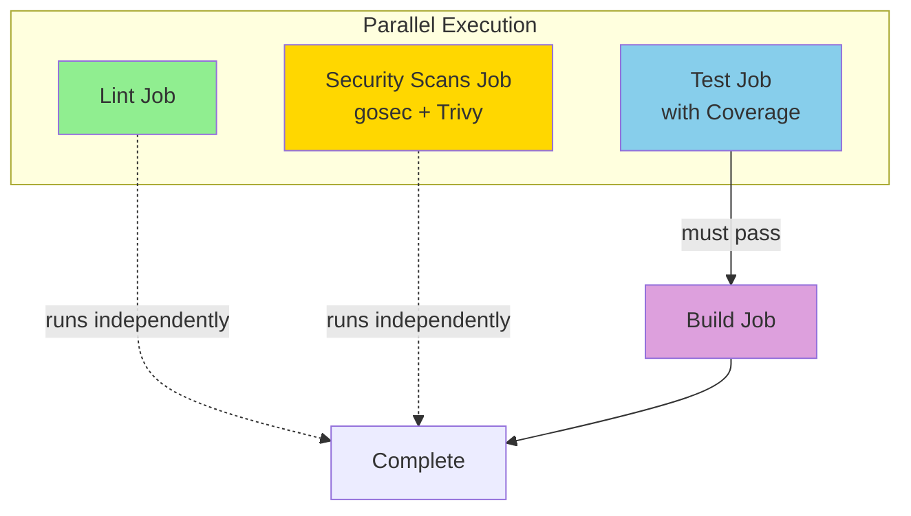
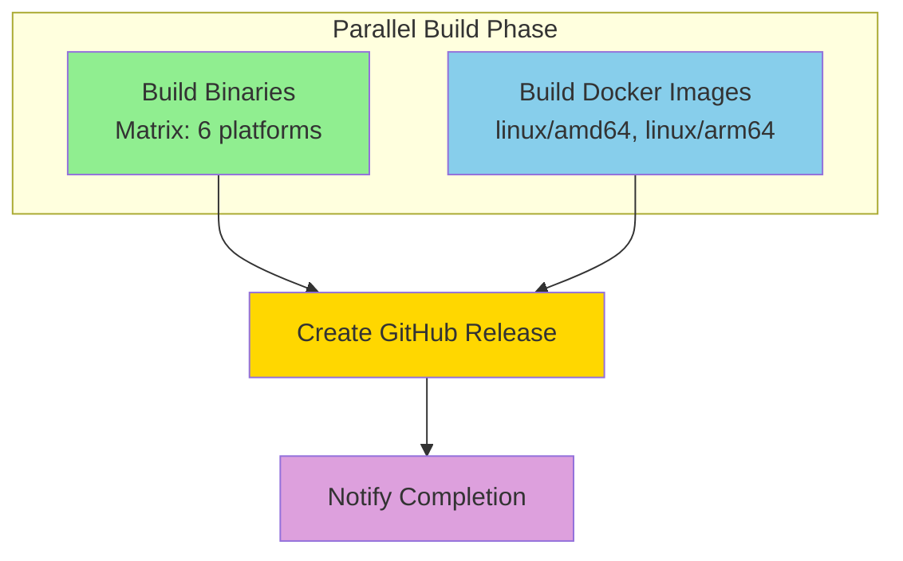
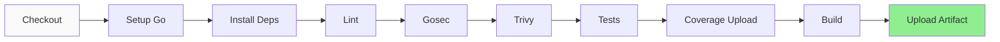
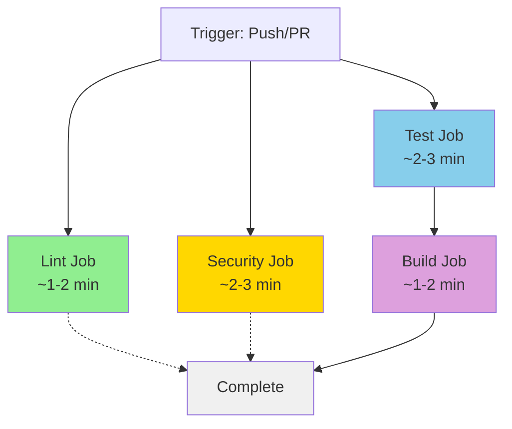

# Contributing to Glory-Hole

Thank you for your interest in contributing to Glory-Hole! This document provides guidelines and instructions for contributing to the project.

## Table of Contents

1. [Code of Conduct](#code-of-conduct)
2. [How to Contribute](#how-to-contribute)
3. [Development Setup](#development-setup)
4. [Code Style and Standards](#code-style-and-standards)
5. [Testing Requirements](#testing-requirements)
6. [Pull Request Process](#pull-request-process)
7. [Commit Message Format](#commit-message-format)
8. [Branch Naming Conventions](#branch-naming-conventions)
9. [Documentation Standards](#documentation-standards)
10. [Performance Considerations](#performance-considerations)
11. [Security Considerations](#security-considerations)
12. [Release Process](#release-process)

## Code of Conduct

### Our Pledge

We are committed to providing a welcoming and inspiring community for all. We pledge to:

- Be respectful and inclusive
- Welcome newcomers and help them get started
- Accept constructive criticism gracefully
- Focus on what is best for the community
- Show empathy towards other community members

### Our Standards

**Positive behavior includes:**
- Using welcoming and inclusive language
- Being respectful of differing viewpoints and experiences
- Gracefully accepting constructive criticism
- Focusing on what is best for the community
- Showing empathy towards other community members

**Unacceptable behavior includes:**
- Harassment, trolling, or insulting/derogatory comments
- Public or private harassment
- Publishing others' private information without permission
- Other conduct which could reasonably be considered inappropriate

### Enforcement

Instances of unacceptable behavior may be reported to the project maintainers. All complaints will be reviewed and investigated promptly and fairly.

## How to Contribute

There are many ways to contribute to Glory-Hole:

### Reporting Bugs

Before creating bug reports, please check existing issues to avoid duplicates. When creating a bug report, include:

**Bug Report Template:**
```
**Description:**
A clear and concise description of the bug.

**To Reproduce:**
Steps to reproduce the behavior:
1. Start Glory-Hole with config '...'
2. Send DNS query '...'
3. See error

**Expected Behavior:**
What you expected to happen.

**Actual Behavior:**
What actually happened.

**Environment:**
- Glory-Hole version: [e.g., 0.6.0]
- OS: [e.g., Ubuntu 22.04]
- Go version: [e.g., 1.25.4]
- Configuration: [relevant config.yml sections]

**Logs:**
```
Include relevant log output
```

**Additional Context:**
Any other information that might be helpful.
```

### Suggesting Features

Feature requests are welcome! Please provide:

**Feature Request Template:**
```
**Feature Description:**
Clear description of the feature.

**Use Case:**
Why is this feature needed? What problem does it solve?

**Proposed Solution:**
How do you envision this working?

**Alternatives Considered:**
What other approaches did you consider?

**Additional Context:**
Any other relevant information.
```

### Contributing Documentation

Documentation improvements are always welcome:
- Fix typos and clarify explanations
- Add examples and use cases
- Improve API documentation
- Add diagrams and illustrations
- Translate documentation

### Contributing Code

Code contributions should:
- Solve a real problem or add meaningful functionality
- Follow project coding standards
- Include comprehensive tests
- Update relevant documentation
- Pass all CI checks

## Development Setup

### Prerequisites

**Required:**
- Go 1.25.4 or later
- Git

**Recommended:**
- golangci-lint for linting
- gopls for IDE integration
- delve for debugging

### Repository Setup

1. **Fork the repository** on GitHub

2. **Clone your fork:**
```bash
git clone https://github.com/YOUR_USERNAME/glory-hole.git
cd glory-hole
```

3. **Add upstream remote:**
```bash
git remote add upstream https://github.com/ORIGINAL_OWNER/glory-hole.git
```

4. **Install dependencies:**
```bash
go mod download
```

5. **Verify setup:**
```bash
# Run tests
make test

# Build binary (includes version info)
make build

# Run linter
make lint

# See all available commands
make help
```

### Project Structure

```
glory-hole/
├── cmd/glory-hole/          # Main application entry point
├── pkg/                     # Core packages
│   ├── api/                 # REST API and Web UI
│   ├── blocklist/           # Lock-free blocklist management
│   ├── cache/               # LRU cache with TTL
│   ├── config/              # Configuration management
│   ├── dns/                 # DNS server and handler
│   ├── forwarder/           # Upstream DNS forwarding
│   ├── localrecords/        # Local DNS records (A/AAAA/CNAME)
│   ├── logging/             # Structured logging
│   ├── policy/              # Policy engine (expr-based rules)
│   ├── storage/             # Multi-backend storage (SQLite/D1)
│   └── telemetry/           # OpenTelemetry metrics
├── test/                    # Integration and load tests
├── docs/                    # Documentation
├── config/                  # Example configurations
├── deploy/                  # Deployment scripts and configs
└── scripts/                 # Utility scripts
```

### IDE Setup

**VS Code:**
1. Install Go extension
2. Recommended settings (`.vscode/settings.json`):
```json
{
  "go.testFlags": ["-v", "-race"],
  "go.lintTool": "golangci-lint",
  "go.lintOnSave": "package",
  "go.formatTool": "goimports",
  "go.useLanguageServer": true,
  "[go]": {
    "editor.formatOnSave": true,
    "editor.codeActionsOnSave": {
      "source.organizeImports": true
    }
  }
}
```

**GoLand:**
- Enable `gofmt` on save
- Configure golangci-lint as external tool
- Enable Go Modules integration

## Code Style and Standards

### Go Conventions

Follow standard Go conventions:
- Use `gofmt` for formatting (enforced by CI)
- Follow [Effective Go](https://golang.org/doc/effective_go.html)
- Follow [Go Code Review Comments](https://github.com/golang/go/wiki/CodeReviewComments)

### Naming Conventions

**Packages:**
- Use lowercase, single-word names
- Avoid underscores or mixed caps
- Examples: `cache`, `policy`, `blocklist`

**Types:**
- Use PascalCase for exported types
- Use camelCase for unexported types
- Be descriptive but concise
```go
type PolicyEngine struct { ... }  // Exported
type cacheEntry struct { ... }    // Unexported
```

**Functions:**
- Use PascalCase for exported functions
- Use camelCase for unexported functions
- Start with verb (Get, Set, Handle, Process, etc.)
```go
func LoadBlocklist(path string) error { ... }  // Exported
func parseHostsFile(data []byte) map[string]struct{} { ... }  // Unexported
```

**Variables:**
- Use camelCase
- Short names for short scopes (i, j, k for loops)
- Descriptive names for larger scopes
```go
for i, domain := range blocklist { ... }
blocklistManager := blocklist.NewManager(cfg, logger)
```

**Constants:**
- Use PascalCase for exported constants
- Use camelCase or UPPER_CASE for unexported
```go
const DefaultTimeout = 5 * time.Second
const maxRetries = 3
```

### Comments

**Package comments:**
```go
// Package cache implements a thread-safe DNS response cache with LRU
// eviction and TTL support.
//
// The cache uses a single RWMutex for all operations, following our
// optimization pattern of minimizing lock contention.
package cache
```

**Function comments:**
```go
// NewEngine creates a new policy engine with no rules.
// Rules must be added using AddRule before evaluation.
func NewEngine() *Engine {
    ...
}
```

**Inline comments:**
- Explain "why", not "what"
- Keep comments up-to-date with code
- Avoid obvious comments

```go
// Good: Explains why
// Lock-free atomic pointer read - blazing fast!
blocked := h.BlocklistManager.IsBlocked(domain)

// Bad: States the obvious
// Check if domain is blocked
blocked := h.BlocklistManager.IsBlocked(domain)
```

### Error Handling

**Always handle errors:**
```go
// Good
resp, err := h.Forwarder.Forward(ctx, r)
if err != nil {
    return fmt.Errorf("failed to forward query: %w", err)
}

// Bad
resp, _ := h.Forwarder.Forward(ctx, r)
```

**Wrap errors with context:**
```go
if err := storage.LogQuery(ctx, query); err != nil {
    return fmt.Errorf("failed to log query for domain %s: %w", domain, err)
}
```

**Define custom errors when appropriate:**
```go
var (
    ErrInvalidBackend = errors.New("invalid storage backend")
    ErrNotFound       = errors.New("record not found")
)
```

### Concurrency

**Use appropriate synchronization:**
```go
// Prefer atomic operations for simple counters
var counter atomic.Uint64
counter.Add(1)

// Use RWMutex for read-heavy workloads
type Cache struct {
    mu      sync.RWMutex
    entries map[string]*entry
}

// Use channels for coordination
stopCh := make(chan struct{})
```

**Avoid data races:**
- Always protect shared data with locks or atomics
- Use `go test -race` to detect races
- Document thread-safety in comments

### Performance Best Practices

**Minimize allocations:**
```go
// Use sync.Pool for frequently allocated objects
var msgPool = sync.Pool{
    New: func() interface{} {
        return new(dns.Msg)
    },
}

// Pre-allocate slices when size is known
entries := make([]*Entry, 0, expectedSize)

// Reuse buffers
var buf bytes.Buffer
buf.Reset()
```

**Cache expensive operations:**
```go
// Compile regex once, not per request
var domainRegex = regexp.MustCompile(`^[a-z0-9.-]+$`)

// Pre-compile expressions at startup
program, err := expr.Compile(rule.Logic, expr.Env(Context{}))
```

**Avoid unnecessary work:**
```go
// Check cache before expensive operations
if cachedResp := h.Cache.Get(ctx, r); cachedResp != nil {
    return cachedResp, nil
}

// Early return when possible
if len(r.Question) == 0 {
    return dns.RcodeFormatError
}
```

## Testing Requirements

### Test Coverage

- Maintain **>80% coverage** for all packages
- Aim for **>90%** for critical paths (DNS handler, policy engine)
- Test edge cases and error paths
- Run with race detector: `go test -race ./...`

### Test Organization

**File naming:**
- `*_test.go` for tests in same package
- `*_integration_test.go` for integration tests
- `*_benchmark_test.go` for benchmarks

**Test naming:**
```go
// Format: TestFunctionName_Scenario
func TestGet_CacheHit(t *testing.T) { ... }
func TestGet_CacheMiss(t *testing.T) { ... }
func TestGet_Expired(t *testing.T) { ... }

// For table-driven tests
func TestDomainMatches(t *testing.T) {
    tests := []struct {
        name     string
        domain   string
        pattern  string
        expected bool
    }{
        {"exact match", "example.com", "example.com", true},
        {"subdomain", "www.example.com", ".example.com", true},
        ...
    }
    ...
}
```

### Unit Tests

Test individual functions in isolation:

```go
func TestCache_Set_Success(t *testing.T) {
    // Arrange
    logger := logging.NewLogger(&logging.Config{Level: "error"})
    cfg := &config.CacheConfig{
        Enabled:    true,
        MaxEntries: 100,
        MinTTL:     60 * time.Second,
        MaxTTL:     24 * time.Hour,
    }
    cache, err := New(cfg, logger)
    require.NoError(t, err)
    defer cache.Close()

    // Act
    query := new(dns.Msg)
    query.SetQuestion("example.com.", dns.TypeA)

    resp := new(dns.Msg)
    resp.SetReply(query)

    cache.Set(context.Background(), query, resp)

    // Assert
    cached := cache.Get(context.Background(), query)
    require.NotNil(t, cached)
    assert.Equal(t, resp.Question[0].Name, cached.Question[0].Name)
}
```

### Integration Tests

Test component interactions:

```go
func TestDNSServer_EndToEnd(t *testing.T) {
    // Setup full DNS server with all components
    cfg := &config.Config{ ... }
    logger := logging.NewLogger(&logging.Config{Level: "error"})

    handler := dns.NewHandler()
    cache, _ := cache.New(&cfg.Cache, logger)
    handler.SetCache(cache)

    // ... setup other components

    // Test DNS query
    query := new(dns.Msg)
    query.SetQuestion("example.com.", dns.TypeA)

    w := &testResponseWriter{}
    handler.ServeDNS(context.Background(), w, query)

    // Verify response
    assert.Equal(t, dns.RcodeSuccess, w.msg.Rcode)
}
```

### Benchmark Tests

Measure performance:

```go
func BenchmarkCache_Get(b *testing.B) {
    cache, _ := setupCache()
    query := makeQuery("example.com.")
    resp := makeResponse(query)

    cache.Set(context.Background(), query, resp)

    b.ResetTimer()
    b.RunParallel(func(pb *testing.PB) {
        for pb.Next() {
            cache.Get(context.Background(), query)
        }
    })
}
```

### Test Utilities

Create helper functions for common test setup:

```go
// test/testutil/helpers.go
func MakeDNSQuery(domain string, qtype uint16) *dns.Msg {
    msg := new(dns.Msg)
    msg.SetQuestion(dns.Fqdn(domain), qtype)
    return msg
}

func MustParseIP(s string) net.IP {
    ip := net.ParseIP(s)
    if ip == nil {
        panic(fmt.Sprintf("invalid IP: %s", s))
    }
    return ip
}
```

## Pull Request Process

### Before Submitting

1. **Update from upstream:**
```bash
git fetch upstream
git rebase upstream/main
```

2. **Run tests:**
```bash
go test -v -race ./...
```

3. **Run linter:**
```bash
golangci-lint run
```

4. **Check test coverage:**
```bash
go test -coverprofile=coverage.out ./...
go tool cover -func=coverage.out
```

5. **Update documentation:**
- Update relevant README sections
- Add/update code comments
- Update API documentation
- Add examples if appropriate

### Creating Pull Request

1. **Push to your fork:**
```bash
git push origin feature/your-feature-name
```

2. **Create PR on GitHub:**
- Use clear, descriptive title
- Fill out PR template completely
- Link related issues
- Add screenshots/examples if applicable

**PR Template:**
```markdown
## Description
Brief description of changes.

## Type of Change
- [ ] Bug fix (non-breaking change)
- [ ] New feature (non-breaking change)
- [ ] Breaking change (fix or feature that would cause existing functionality to not work as expected)
- [ ] Documentation update

## Related Issues
Fixes #123

## How Has This Been Tested?
Describe the tests you ran to verify your changes.

## Checklist
- [ ] Code follows project style guidelines
- [ ] Self-review completed
- [ ] Code commented, particularly in hard-to-understand areas
- [ ] Documentation updated
- [ ] No new warnings generated
- [ ] Tests added that prove fix/feature works
- [ ] New and existing tests pass locally
- [ ] No race conditions (tested with -race)
- [ ] Coverage maintained or improved
```

### Review Process

1. **Automated checks** must pass:
   - Tests (with race detector)
   - Linting (golangci-lint)
   - Security scanning (gosec)
   - Coverage check

2. **Code review** by maintainers:
   - At least one approval required
   - Address all comments
   - Keep discussion professional

3. **Merge:**
   - Maintainer will merge when approved
   - Delete branch after merge

## Commit Message Format

We follow [Conventional Commits](https://www.conventionalcommits.org/):

### Format

```
<type>(<scope>): <subject>

<body>

<footer>
```

### Types

- `feat`: New feature
- `fix`: Bug fix
- `docs`: Documentation only
- `style`: Code style changes (formatting, etc.)
- `refactor`: Code refactoring
- `perf`: Performance improvement
- `test`: Adding or updating tests
- `chore`: Maintenance tasks
- `ci`: CI/CD changes

### Examples

```
feat(policy): add regex domain matching support

Add DomainRegex helper function to policy engine for advanced
domain pattern matching using regular expressions.

Closes #234
```

```
fix(cache): prevent race condition in cleanup loop

Use proper mutex locking when removing expired entries during
background cleanup to prevent concurrent map access.

Fixes #245
```

```
perf(blocklist): optimize lookup with lock-free atomic pointer

Replace RWMutex with atomic.Pointer for zero-copy reads during
blocklist lookups, improving performance from 110ns to 10ns.

Benchmark results:
- Before: 110ns/op
- After:  10ns/op
- Improvement: 11x faster
```

```
docs: add contribution guidelines and development setup

Add CONTRIBUTING.md with comprehensive guidelines covering:
- Code style and conventions
- Testing requirements
- PR process
- Development setup
```

## Branch Naming Conventions

Use descriptive branch names following this pattern:

```
<type>/<issue-number>-<short-description>
```

### Types

- `feature/` - New features
- `fix/` - Bug fixes
- `docs/` - Documentation changes
- `refactor/` - Code refactoring
- `test/` - Test improvements
- `chore/` - Maintenance tasks

### Examples

```
feature/123-policy-engine
fix/234-cache-race-condition
docs/add-contributing-guide
refactor/consolidate-locks
test/improve-dns-coverage
chore/update-dependencies
```

## Documentation Standards

### Code Documentation

**Package level:**
- Describe package purpose
- List key types and functions
- Include usage examples

**Function level:**
- Describe what the function does
- Document parameters
- Document return values
- Note any special behavior or side effects

**Type level:**
- Describe the type's purpose
- Document exported fields
- Note thread-safety characteristics

### README Documentation

When updating README:
- Keep sections organized and consistent
- Include code examples
- Add links to detailed documentation
- Update table of contents
- Verify all links work

### API Documentation

For REST API changes:
- Update endpoint documentation
- Include request/response examples
- Document query parameters
- Note any breaking changes
- Update OpenAPI/Swagger specs

## Performance Considerations

### Profiling

Before optimizing, **profile**:

```bash
# CPU profiling
go test -cpuprofile=cpu.prof -bench=.
go tool pprof cpu.prof

# Memory profiling
go test -memprofile=mem.prof -bench=.
go tool pprof mem.prof

# Benchmarking
go test -bench=. -benchmem -benchtime=10s
```

### Guidelines

1. **Measure first** - Don't optimize without data
2. **Optimize hot paths** - Focus on frequently executed code
3. **Minimize allocations** - Use sync.Pool, pre-allocate slices
4. **Lock efficiently** - Use appropriate lock granularity
5. **Cache expensive operations** - Pre-compute when possible
6. **Profile regularly** - Catch regressions early

### Performance Budgets

Maintain these targets:
- Cache hit: <100ns
- Blocklist lookup: <10ns (lock-free)
- DNS query (cached): <5ms
- DNS query (upstream): <50ms
- Policy evaluation: <1μs

## Security Considerations

### Security Review

All code changes must:
1. Pass gosec security scanner
2. Avoid common vulnerabilities (SQL injection, XSS, etc.)
3. Handle untrusted input safely
4. Use proper authentication/authorization
5. Log security-relevant events

### Common Pitfalls

**Input validation:**
```go
// Always validate user input
func ParseDomain(domain string) (string, error) {
    if domain == "" {
        return "", errors.New("domain cannot be empty")
    }
    if len(domain) > 253 {
        return "", errors.New("domain too long")
    }
    return strings.ToLower(domain), nil
}
```

**SQL injection:**
```go
// Use parameterized queries
db.Query("SELECT * FROM queries WHERE domain = ?", domain)

// NOT: db.Query("SELECT * FROM queries WHERE domain = '" + domain + "'")
```

**File operations:**
```go
// Validate file paths to prevent directory traversal
path := filepath.Clean(userInput)
if !strings.HasPrefix(path, allowedDir) {
    return errors.New("invalid path")
}
```

### Reporting Security Issues

**Do NOT** open public issues for security vulnerabilities.

Instead:
1. Email security@glory-hole.dev (if available) or maintainer directly
2. Include detailed description
3. Provide steps to reproduce
4. Suggest fix if possible

We will respond within 48 hours and coordinate disclosure.

## CI/CD Workflows

### Overview

Glory-Hole uses GitHub Actions for continuous integration and deployment. Our workflows are optimized for speed and efficiency through parallelization and caching.

### CI Workflow (.github/workflows/ci.yml)

The CI workflow runs on every push to `main` and on all pull requests. It has been optimized to run jobs in parallel for faster feedback.

#### Workflow Structure



#### Jobs Breakdown

**1. Lint Job** (runs independently)
- Runs golangci-lint for code quality checks
- Fast feedback on style and potential issues
- Uses Go 1.25.4 with module caching enabled

**2. Security Scans Job** (runs in parallel)
- Runs gosec security scanner
- Runs Trivy vulnerability scanner
- Uploads results to GitHub Security tab
- Uses `continue-on-error` to not block workflow

**3. Test Job** (critical path)
- Runs all unit tests with race detector
- Generates coverage report
- Uploads coverage to Codecov
- Build job depends on this passing

**4. Build Job** (runs after tests pass)
- Only runs if test job succeeds
- Builds binary for Linux AMD64
- Uploads artifact for 7 days

#### Performance Optimizations

1. **Parallelization**: 3 jobs run simultaneously (lint, security, test)
2. **Go Module Caching**: All jobs use `cache: true` in `actions/setup-go@v5`
3. **Dependency Management**: Explicit `go mod download` for predictable caching
4. **Conditional Execution**: Build only runs after tests pass

**Expected Runtime**: 3-5 minutes (vs. 10-15 minutes sequentially)

### Release Workflow (.github/workflows/release.yml)

The release workflow triggers on git tags matching `v*` pattern and handles building binaries, Docker images, and creating GitHub releases.

#### Workflow Structure



#### Build Matrix

**Binary Builds** (runs 6 jobs in parallel):
- linux/amd64
- linux/arm64
- darwin/amd64 (Intel Mac)
- darwin/arm64 (Apple Silicon)
- windows/amd64
- windows/arm64

Each binary includes:
- Version from git tag
- Build timestamp
- Git commit hash
- Compressed with gzip
- SHA256 checksum

**Docker Builds** (runs in parallel with binaries):
- Multi-arch: linux/amd64, linux/arm64
- Pushed to Docker Hub and GitHub Container Registry
- Uses build cache for faster builds
- Tagged with version, major.minor, major, and latest

#### Performance Optimizations

1. **Matrix Strategy**: 6 binary builds run in parallel
2. **Concurrent Docker Build**: Runs alongside binary builds
3. **Go Caching**: Module and build cache enabled
4. **Docker Layer Caching**: Uses GitHub Actions cache
5. **Artifact Retention**: 7 days (increased from 1 day)

### Before vs. After Optimization

#### CI Workflow Comparison

**Before (Sequential):**


**After (Parallel):**


**Key Improvements:**
- ⚡ **3-4x faster**: 3-5 minutes vs. 10-15 minutes
- 🔄 **Parallel execution**: 3 jobs run simultaneously
- 💾 **Go caching**: 20-40% faster dependency downloads
- 🎯 **Smart dependencies**: Build only runs if tests pass

### Running Workflows Locally

**Test workflow syntax:**
```bash
# Install act (GitHub Actions local runner)
brew install act  # macOS
# or: curl https://raw.githubusercontent.com/nektos/act/master/install.sh | sudo bash

# Run CI workflow locally
act push -W .github/workflows/ci.yml

# Run specific job
act push -j test -W .github/workflows/ci.yml
```

**Validate workflow files:**
```bash
# Using yamllint
yamllint .github/workflows/*.yml

# Using actionlint
brew install actionlint
actionlint .github/workflows/*.yml
```

### Workflow Triggers

**CI Workflow:**
- Push to `main` branch
- Pull requests to `main` branch

**Release Workflow:**
- Tags matching `v*` pattern (e.g., `v0.7.9`, `v1.0.0`)

### Required Secrets

For release workflow to work:
- `DOCKER_USERNAME` - Docker Hub username
- `DOCKER_PASSWORD` - Docker Hub access token
- `GITHUB_TOKEN` - Automatically provided by GitHub

## Release Process

### Version Numbers

We use [Semantic Versioning](https://semver.org/):
- `MAJOR.MINOR.PATCH`
- Example: `0.6.0`, `1.0.0`, `1.2.3`

**Incrementing:**
- `MAJOR`: Breaking changes
- `MINOR`: New features (backward compatible)
- `PATCH`: Bug fixes (backward compatible)

### Release Checklist

1. **Update version:**
   - Update `VERSION` file
   - Update `version` in `cmd/glory-hole/main.go`
   - Update README badges

2. **Update CHANGELOG:**
   - Document all changes since last release
   - Categorize: Added, Changed, Fixed, Removed
   - Credit contributors

3. **Create release branch:**
```bash
git checkout -b release/v0.6.0
```

4. **Final testing:**
```bash
# Run all tests with race detector
make test-race

# Build for all platforms (Linux, macOS, Windows, multiple architectures)
make build-all

# Run linter
make lint
```

5. **Tag release:**
```bash
git tag -a v0.6.0 -m "Release v0.6.0"
git push origin v0.6.0
```

6. **Create GitHub release:**
   - Upload binaries
   - Copy CHANGELOG section
   - Mark as pre-release if applicable

7. **Announce:**
   - Update project website
   - Post to community channels
   - Update documentation

---

## Getting Help

- **Questions:** Open a GitHub Discussion
- **Bugs:** Open a GitHub Issue
- **Chat:** Join our Discord/Slack (if available)
- **Email:** contact@glory-hole.dev (if available)

## License

By contributing, you agree that your contributions will be licensed under the same license as the project (MIT License).

---

**Thank you for contributing to Glory-Hole!**
