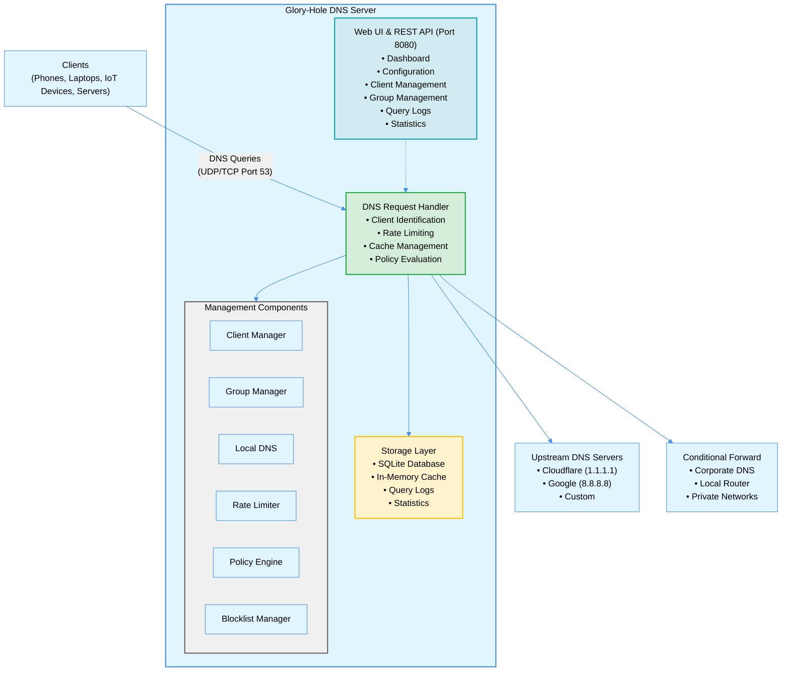

# Glory-Hole System Architecture

> A high-performance DNS server written in Go, designed as a modern, extensible replacement for Pi-hole and similar solutions.

**Version:** 2.0
**Last Updated:** 2025-01-20
**Status:** Design Phase

---

## Table of Contents

1. [Executive Summary](#executive-summary)
2. [System Overview](#system-overview)
3. [Architecture Principles](#architecture-principles)
4. [System Architecture](#system-architecture)
5. [Core Components](#core-components)
6. [DNS Request Processing](#dns-request-processing)
7. [Data Models](#data-models)
8. [Storage Layer](#storage-layer)
9. [Configuration Management](#configuration-management)
10. [API Layer](#api-layer)
11. [Security Architecture](#security-architecture)
12. [Performance Architecture](#performance-architecture)
13. [Deployment Architecture](#deployment-architecture)
14. [Testing Strategy](#testing-strategy)
15. [Implementation Roadmap](#implementation-roadmap)
16. [Migration & Compatibility](#migration--compatibility)
17. [Future Vision](#future-vision)

---

## Executive Summary

### Project Vision

Glory-Hole is a next-generation DNS server that combines the simplicity of Pi-hole with enterprise-grade features, providing:

- **Network-Wide Ad Blocking** - Block unwanted content at the DNS level
- **Advanced Client Management** - Per-device policies and tracking
- **Group-Based Policies** - Organize devices with shared rules
- **Split-DNS Support** - Seamless corporate/home network integration
- **Local DNS Authority** - Full authoritative DNS for local networks
- **Performance First** - Sub-5ms cache hits, 10k+ queries/second
- **Single Binary** - Zero dependencies, simple deployment

### Key Differentiators

| Feature | Pi-hole | AdGuard Home | Glory-Hole |
|---------|---------|--------------|------------|
| Single Binary |  |  |  |
| Group Management | Limited |  |  Advanced |
| Rate Limiting |  | Basic |  Advanced |
| Conditional Forwarding | Basic | Basic |  Advanced |
| Policy Engine |  |  |  Expression-based |
| Local DNS Records | Basic | Basic |  Full DNS Server |
| Performance | Good | Good |  Optimized |
| Language | PHP/Bash | Go | Go |

### Target Use Cases

1. **Home Networks** - Family internet with parental controls
2. **Small Business** - Office network with policy enforcement
3. **Work From Home** - Split-DNS for corporate/personal
4. **IoT Networks** - Segmented device management
5. **Developer Labs** - Local DNS for development environments
6. **Security Conscious** - DNS-level threat blocking

---

## System Overview

### High-Level Architecture



### Technology Stack

**Core Runtime:**
- **Language:** Go 1.24+
- **DNS Library:** codeberg.org/miekg/dns (v2)
- **Database:** modernc.org/sqlite (CGO-free)
- **Expression Engine:** github.com/expr-lang/expr
- **HTTP Framework:** net/http (stdlib)

**Key Libraries:**
- `golang.org/x/time/rate` - Rate limiting
- `golang.org/x/sync` - Concurrency primitives
- `gopkg.in/yaml.v3` - Configuration parsing

**Build & Deploy:**
- Single static binary
- Cross-compilation support
- Docker containerization
- Systemd service integration

---

## Architecture Principles

### Design Philosophy

1. **Simplicity First**
   - Single binary with no external dependencies
   - Configuration via simple YAML file
   - Sensible defaults, minimal required config

2. **Performance Driven**
   - Zero-allocation hot paths
   - In-memory caching with TTL awareness
   - Concurrent request processing
   - Efficient data structures (sync.Map, LRU caches)

3. **Domain-Driven Design**
   - Clear separation of concerns
   - Each package owns its domain
   - Well-defined interfaces between components
   - Testable, modular architecture

4. **Operational Excellence**
   - Comprehensive logging and metrics
   - Hot configuration reloading
   - Graceful degradation
   - Self-healing capabilities

5. **Security by Default**
   - Rate limiting enabled
   - Input validation everywhere
   - Secure defaults
   - Privacy-conscious logging

### Core Patterns

**Concurrent Processing:**
```go
// Each DNS query is handled in its own goroutine
func (s *Server) ListenAndServe() error {
    for {
        conn, err := listener.Accept()
        if err != nil {
            continue
        }
        go s.handleConnection(conn)  // Concurrent handling
    }
}
```

**Middleware Pattern:**
```go
// Request processing uses middleware chain
type Middleware func(Handler) Handler

func (s *Server) chain(h Handler, middlewares ...Middleware) Handler {
    for i := len(middlewares) - 1; i >= 0; i-- {
        h = middlewares[i](h)
    }
    return h
}
```

**Manager Pattern:**
```go
// Each domain has a manager for lifecycle and operations
type ClientManager interface {
    GetClient(ip net.IP) (*Client, error)
    CreateClient(client *Client) error
    UpdateClient(client *Client) error
    DeleteClient(id string) error
}
```

---

## System Architecture

### Layered Architecture

```mermaid
%%{init: {'theme':'base', 'themeVariables': { 'primaryColor':'#e1f5ff','primaryTextColor':'#000','primaryBorderColor':'#4a90e2','lineColor':'#4a90e2','secondaryColor':'#f0f0f0','tertiaryColor':'#fff'}}}%%
graph TB
    subgraph Presentation["Presentation Layer"]
        RESTAPI["REST API<br/>(HTTP/JSON)"]
        WebUI["Web UI<br/>(Static HTML)"]
        DNSServer["DNS Server<br/>(UDP/TCP)"]
    end

    subgraph Service["Service Layer"]
        ClientSvc["Client Service"]
        GroupSvc["Group Service"]
        BlocklistSvc["Blocklist Service"]
        QuerySvc["Query Service"]
        StatsSvc["Stats Service"]
        PolicySvc["Policy Service"]
    end

    subgraph Domain["Domain Layer"]
        ClientMgr["Client Manager"]
        GroupMgr["Group Manager"]
        QueryCtx["Query Context"]
        RateLimiter["Rate Limiter"]
        PolicyEngine["Policy Engine"]
        CacheMgr["Cache Manager"]
        LocalRecords["Local Records"]
        CNAMEMgr["CNAME Manager"]
        ConditionalFwd["Conditional Forwarder"]
    end

    subgraph Infrastructure["Infrastructure Layer"]
        SQLite["SQLite Storage"]
        MemCache["In-Memory Cache"]
        FileSystem["File System"]
        NetworkIO["Network I/O"]
        Logger["Logger"]
        Metrics["Metrics Collector"]
    end

    Presentation --> Service
    Service --> Domain
    Domain --> Infrastructure

    style Presentation fill:#d1ecf1,stroke:#17a2b8,stroke-width:2px,color:#000
    style Service fill:#d4edda,stroke:#28a745,stroke-width:2px,color:#000
    style Domain fill:#fff3cd,stroke:#ffc107,stroke-width:2px,color:#000
    style Infrastructure fill:#f8d7da,stroke:#dc3545,stroke-width:2px,color:#000
```



### Package Structure

```
gloryhole/
├── cmd/
│   └── glory-hole/
│       └── main.go                 # Application entry point
│
├── pkg/
│   ├── config/                     # Configuration management
│   │   ├── config.go              # Config structures
│   │   ├── loader.go              # YAML loading
│   │   └── validator.go           # Config validation
│   │
│   ├── dns/                        # DNS server core
│   │   ├── server.go              # DNS server implementation
│   │   ├── handler.go             # Request handler
│   │   ├── cache.go               # Response caching
│   │   └── forwarder.go           # Upstream forwarding
│   │
│   ├── client/                     # Client management
│   │   ├── manager.go             # Client lifecycle
│   │   ├── client.go              # Client model
│   │   └── repository.go          # Client persistence
│   │
│   ├── group/                      # Group management
│   │   ├── manager.go             # Group lifecycle
│   │   ├── group.go               # Group model
│   │   └── membership.go          # Client-group mapping
│   │
│   ├── policy/                     # Policy engine
│   │   ├── engine.go              # Rule evaluation
│   │   ├── rule.go                # Rule definitions
│   │   └── context.go             # Evaluation context
│   │
│   ├── ratelimit/                  # Rate limiting
│   │   ├── limiter.go             # Token bucket impl
│   │   ├── store.go               # Limiter storage
│   │   └── violations.go          # Violation tracking
│   │
│   ├── localrecords/               # Local DNS records
│   │   ├── manager.go             # Record management
│   │   ├── record.go              # Record models
│   │   └── matcher.go             # Wildcard matching
│   │
│   ├── cname/                      # CNAME management
│   │   ├── manager.go             # CNAME lifecycle
│   │   ├── resolver.go            # Chain resolution
│   │   └── validator.go           # CNAME validation
│   │
│   ├── forwarder/                  # Conditional forwarding
│   │   ├── conditional.go         # Forwarder logic
│   │   └── matcher.go             # Domain matching
│   │
│   ├── blocklist/                  # Blocklist management
│   │   ├── manager.go             # List management
│   │   ├── downloader.go          # Remote list fetching
│   │   └── parser.go              # Hosts file parsing
│   │
│   ├── storage/                    # Persistence layer
│   │   ├── storage.go             # Database interface
│   │   ├── migrations.go          # Schema migrations
│   │   ├── queries.go             # Query logs
│   │   └── stats.go               # Statistics
│   │
│   ├── api/                        # REST API
│   │   ├── server.go              # HTTP server
│   │   ├── handlers.go            # Request handlers
│   │   ├── middleware.go          # Auth, logging, etc.
│   │   └── dto.go                 # Data transfer objects
│   │
│   └── web/                        # Web UI
│       ├── static/                # Static assets
│       └── templates/             # HTML templates
│
├── internal/                       # Private application code
│   ├── metrics/                   # Metrics collection
│   ├── health/                    # Health checks
│   └── signals/                   # Signal handling
│
├── tests/                          # Integration tests
│   ├── fixtures/                  # Test data
│   └── e2e/                       # End-to-end tests
│
├── docs/                           # Documentation
│   ├── ARCHITECTURE.md            # This file
│   ├── DESIGN.md                  # Feature designs
│   └── API.md                     # API documentation
│
├── config.example.yml              # Example configuration
├── go.mod                          # Go module definition
└── README.md                       # Project overview
```

---

## Core Components

### 1. DNS Handler

**Purpose:** Core DNS request processing engine

**Location:** `pkg/dns/handler.go`

**Responsibilities:**
- Parse incoming DNS requests
- Orchestrate processing pipeline
- Build and send DNS responses
- Handle protocol specifics (UDP/TCP)

**Key Interfaces:**
```go
type Handler interface {
    ServeDNS(ctx context.Context, w ResponseWriter, r *Msg)
}

type DNSServer struct {
    handler           Handler
    clientManager     *client.Manager
    groupManager      *group.Manager
    policyEngine      *policy.Engine
    rateLimiter       *ratelimit.Limiter
    cache             *Cache
    localRecords      *localrecords.Manager
    cnameManager      *cname.Manager
    conditionalFwd    *forwarder.Manager
    blocklistManager  *blocklist.Manager
    whitelistManager  *whitelist.Manager
}
```

**Request Flow:**
```go
func (h *Handler) ServeDNS(ctx context.Context, w dns.ResponseWriter, r *dns.Msg) {
    // 1. Build query context
    qctx := buildQueryContext(r, w.RemoteAddr())

    // 2. Client identification
    qctx.Client = h.clientManager.GetOrCreate(qctx.ClientIP)

    // 3. Rate limiting
    if !h.rateLimiter.Allow(qctx) {
        return // Drop or delay
    }

    // 4. Group resolution
    qctx.Groups = h.groupManager.GetGroups(qctx.Client)

    // 5. Cache check
    if cached := h.cache.Get(qctx.Domain); cached != nil {
        sendResponse(w, cached)
        return
    }

    // 6. Policy evaluation
    if decision := h.policyEngine.Evaluate(qctx); decision.Block {
        sendBlocked(w, r)
        return
    }

    // 7-10. Local DNS, CNAME, Allow/Block lists
    // ... (detailed in processing pipeline section)

    // 11. Conditional/Upstream forwarding
    resp := h.forward(qctx)

    // 12. Cache and respond
    h.cache.Set(qctx.Domain, resp)
    sendResponse(w, resp)

    // 13. Log and update stats
    h.logQuery(qctx)
}
```

---

### 2. Client Manager

**Purpose:** Track and manage individual DNS clients

**Location:** `pkg/client/manager.go`

**Data Model:**
```go
type Client struct {
    ID          string            `json:"id"`
    IP          net.IP            `json:"ip"`
    MAC         string            `json:"mac,omitempty"`
    Name        string            `json:"name"`
    Groups      []string          `json:"groups"`
    Tags        []string          `json:"tags"`
    Settings    *ClientSettings   `json:"settings"`
    Stats       *ClientStats      `json:"stats"`
    Created     time.Time         `json:"created"`
    LastSeen    time.Time         `json:"last_seen"`
    Enabled     bool              `json:"enabled"`
}

type ClientSettings struct {
    RateLimit        *RateLimit    `json:"rate_limit,omitempty"`
    CustomBlocklist  []string      `json:"custom_blocklist,omitempty"`
    CustomWhitelist  []string      `json:"custom_whitelist,omitempty"`
    UseGroups        bool          `json:"use_groups"`
    LogQueries       bool          `json:"log_queries"`
    CustomUpstreams  []string      `json:"custom_upstreams,omitempty"`
}

type ClientStats struct {
    TotalQueries    uint64                 `json:"total_queries"`
    BlockedQueries  uint64                 `json:"blocked_queries"`
    CachedQueries   uint64                 `json:"cached_queries"`
    LastQueryTime   time.Time              `json:"last_query_time"`
    TopDomains      map[string]uint64      `json:"top_domains"`
}
```

**Key Operations:**
```go
type Manager interface {
    // Lifecycle
    GetClient(ip net.IP) (*Client, error)
    GetOrCreateClient(ip net.IP) *Client
    CreateClient(client *Client) error
    UpdateClient(client *Client) error
    DeleteClient(id string) error

    // Queries
    ListClients(filter ClientFilter) ([]*Client, error)
    SearchClients(query string) ([]*Client, error)

    // Stats
    UpdateStats(clientID string, stats *ClientStats) error
    GetStats(clientID string, period time.Duration) (*ClientStats, error)
}
```

**Caching Strategy:**
- In-memory LRU cache for hot clients (1000 entries)
- Periodic sync to SQLite every 5 minutes
- Lazy loading on cache miss
- Auto-discovery creates transient entries

**Configuration:**
```yaml
client_management:
  enabled: true
  auto_discovery: true
  default_group: "default"
  cache_size: 1000
  sync_interval: "5m"

clients:
  - name: "John's Laptop"
    ip: "192.168.1.100"
    groups: ["family", "adults"]
    settings:
      rate_limit:
        requests_per_second: 100
        burst: 200
```

---

### 3. Group Manager

**Purpose:** Organize clients with shared policies

**Location:** `pkg/group/manager.go`

**Data Model:**
```go
type Group struct {
    Name            string              `json:"name"`
    Description     string              `json:"description"`
    Priority        int                 `json:"priority"`

    // Membership
    ClientIDs       []string            `json:"client_ids"`
    IPRanges        []IPRange           `json:"ip_ranges"`

    // DNS Settings
    Blocklists      []string            `json:"blocklists"`
    Whitelist       []string            `json:"whitelist"`
    CustomOverrides map[string]net.IP   `json:"custom_overrides"`
    Upstreams       []string            `json:"upstreams"`

    // Policies
    RateLimit       *RateLimit          `json:"rate_limit,omitempty"`
    Schedule        *Schedule           `json:"schedule,omitempty"`
    PolicyRules     []*PolicyRule       `json:"policy_rules"`

    // Options
    Enabled         bool                `json:"enabled"`
    InheritGlobal   bool                `json:"inherit_global"`
    LogQueries      bool                `json:"log_queries"`
}

type Schedule struct {
    Enabled     bool          `json:"enabled"`
    TimeRanges  []TimeRange   `json:"time_ranges"`
    Weekdays    []int         `json:"weekdays"`    // 0=Sunday, 6=Saturday
    DateRanges  []DateRange   `json:"date_ranges"`
}
```

**Membership Resolution:**
```go
func (m *Manager) GetGroupsForClient(client *Client) []*Group {
    groups := make([]*Group, 0)

    // 1. Explicit membership
    for _, groupName := range client.Groups {
        if group := m.GetGroup(groupName); group != nil {
            groups = append(groups, group)
        }
    }

    // 2. IP Range membership
    for _, group := range m.ListGroups() {
        for _, ipRange := range group.IPRanges {
            if ipRange.Contains(client.IP) {
                groups = append(groups, group)
            }
        }
    }

    // 3. Sort by priority
    sort.Slice(groups, func(i, j int) bool {
        return groups[i].Priority > groups[j].Priority
    })

    return groups
}
```

**Configuration Examples:**
```yaml
groups:
  # Family group with time restrictions
  - name: "kids"
    description: "Children's devices"
    priority: 100
    schedule:
      enabled: true
      time_ranges:
        - start: "07:00"
          end: "21:00"
      weekdays: [1,2,3,4,5]  # Mon-Fri
    blocklists:
      - "https://raw.githubusercontent.com/StevenBlack/hosts/master/alternates/fakenews-gambling-porn/hosts"
    rate_limit:
      requests_per_second: 30
      burst: 50

  # IoT group with network-based membership
  - name: "iot"
    description: "IoT devices"
    priority: 50
    ip_ranges:
      - cidr: "192.168.10.0/24"
    whitelist:
      - "*.amazonaws.com"
      - "*.google.com"
    rate_limit:
      requests_per_second: 10
      burst: 20
```

---

### 4. Rate Limiter

**Purpose:** Protect against DNS abuse and amplification attacks

**Location:** `pkg/ratelimit/limiter.go`

**Algorithm:** Token Bucket (golang.org/x/time/rate)

**Data Model:**
```go
type RateLimit struct {
    RequestsPerSecond int           `json:"requests_per_second"`
    BurstSize         int           `json:"burst_size"`
    OnExceed          string        `json:"on_exceed"`  // drop, delay, nxdomain
    LogViolations     bool          `json:"log_violations"`
    BlockDuration     time.Duration `json:"block_duration"`
}

type Limiter struct {
    limiters    sync.Map  // clientIP → *rate.Limiter
    violations  sync.Map  // clientIP → []time.Time
    blocked     sync.Map  // clientIP → time.Time (unblock time)

    globalLimit *RateLimit
    mu          sync.RWMutex
}
```

**Implementation:**
```go
func (rl *Limiter) Allow(qctx *QueryContext) bool {
    // 1. Check if client is blocked
    if blockUntil, blocked := rl.blocked.Load(qctx.ClientIP.String()); blocked {
        if time.Now().Before(blockUntil.(time.Time)) {
            rl.logViolation(qctx, "blocked")
            return false
        }
        rl.blocked.Delete(qctx.ClientIP.String())
    }

    // 2. Get limiter for client
    limiter := rl.getLimiter(qctx)

    // 3. Check rate limit
    if !limiter.Allow() {
        rl.handleViolation(qctx)
        return false
    }

    return true
}

func (rl *Limiter) getLimiter(qctx *QueryContext) *rate.Limiter {
    key := qctx.ClientIP.String()

    // Check cache
    if limiter, exists := rl.limiters.Load(key); exists {
        return limiter.(*rate.Limiter)
    }

    // Determine rate limit (client > group > global)
    rateLimit := rl.getRateLimit(qctx)

    // Create limiter
    limiter := rate.NewLimiter(
        rate.Limit(rateLimit.RequestsPerSecond),
        rateLimit.BurstSize,
    )

    rl.limiters.Store(key, limiter)
    return limiter
}

func (rl *Limiter) handleViolation(qctx *QueryContext) {
    key := qctx.ClientIP.String()

    // Track violation
    violations, _ := rl.violations.LoadOrStore(key, &[]time.Time{})
    violationList := violations.(*[]time.Time)
    *violationList = append(*violationList, time.Now())

    // Check if should block
    recentViolations := rl.countRecentViolations(violationList, 1*time.Minute)
    if recentViolations >= 10 {
        // Temporary block
        rl.blocked.Store(key, time.Now().Add(rl.globalLimit.BlockDuration))
        rl.logViolation(qctx, "temporary_block")
    }

    rl.logViolation(qctx, "rate_limit_exceeded")
}
```

**Configuration:**
```yaml
rate_limiting:
  enabled: true
  global:
    requests_per_second: 50
    burst: 100
    on_exceed: "drop"
    log_violations: true
    block_duration: "5m"
  cleanup_interval: "10m"
  max_tracked_clients: 10000
```

---

### 5. Policy Engine

**Purpose:** Evaluate complex filtering rules with expressions

**Location:** `pkg/policy/engine.go`

**Expression Language:** github.com/expr-lang/expr

**Data Model:**
```go
type Rule struct {
    Name       string        `json:"name"`
    Logic      string        `json:"logic"`      // Expression
    Action     string        `json:"action"`     // ALLOW, BLOCK
    ActionData string        `json:"action_data"`
    Priority   int           `json:"priority"`
    Enabled    bool          `json:"enabled"`

    // Compiled
    program    *vm.Program   `json:"-"`
}

type Engine struct {
    rules   []*Rule
    mu      sync.RWMutex
}

type EvaluationContext struct {
    // Request info
    Domain      string
    QueryType   string
    ClientIP    string

    // Time info
    Hour        int
    Minute      int
    Weekday     int
    Date        string

    // Client info
    ClientName  string
    Groups      []string
    Tags        []string

    // Custom data
    Custom      map[string]interface{}
}
```

**Evaluation:**
```go
func (e *Engine) Evaluate(qctx *QueryContext) (bool, *Rule) {
    e.mu.RLock()
    defer e.mu.RUnlock()

    // Build evaluation context
    evalCtx := &EvaluationContext{
        Domain:     qctx.Domain,
        QueryType:  dns.TypeToString[qctx.QueryType],
        ClientIP:   qctx.ClientIP.String(),
        Hour:       time.Now().Hour(),
        Weekday:    int(time.Now().Weekday()),
        ClientName: qctx.Client.Name,
        Groups:     qctx.Client.Groups,
        Tags:       qctx.Client.Tags,
    }

    // Evaluate rules in priority order
    for _, rule := range e.rules {
        if !rule.Enabled {
            continue
        }

        result, err := expr.Run(rule.program, evalCtx)
        if err != nil {
            log.Printf("Rule evaluation error: %v", err)
            continue
        }

        if matched, ok := result.(bool); ok && matched {
            if rule.Action == "BLOCK" {
                return true, rule  // Blocked
            } else if rule.Action == "ALLOW" {
                return false, rule  // Explicitly allowed
            }
        }
    }

    return false, nil  // No match, continue processing
}
```

**Example Rules:**
```yaml
rules:
  - name: "Block social media after 8pm for kids"
    logic: |
      Hour >= 20 &&
      "kids" in Groups &&
      Domain matches ".*(facebook|tiktok|instagram)\\.com"
    action: "BLOCK"
    priority: 100

  - name: "Allow work domains during business hours"
    logic: |
      Hour >= 9 && Hour <= 17 &&
      Weekday >= 1 && Weekday <= 5 &&
      Domain endsWith ".company.com"
    action: "ALLOW"
    priority: 90

  - name: "Block ads globally"
    logic: |
      Domain matches ".*\\.(ads|adservice|doubleclick)\\."
    action: "BLOCK"
    priority: 50
```

**Supported Expressions:**
- String operations: `matches`, `contains`, `startsWith`, `endsWith`
- List operations: `in`, `not in`
- Logical: `&&`, `||`, `!`
- Comparison: `==`, `!=`, `>`, `<`, `>=`, `<=`
- Arithmetic: `+`, `-`, `*`, `/`, `%`

---

### 6. Local Records Manager

**Purpose:** Authoritative DNS for local network

**Location:** `pkg/localrecords/manager.go`

**Supported Record Types:**
- **A** - IPv4 addresses
- **AAAA** - IPv6 addresses
- **CNAME** - Canonical name aliases
- **TXT** - Text records (SPF, DKIM, domain verification)
- **MX** - Mail exchange records (with priority)
- **PTR** - Reverse DNS lookups
- **SRV** - Service discovery (with priority, weight, port)
- **NS** - Nameserver delegation
- **SOA** - Start of Authority (zone management)
- **CAA** - Certificate Authority Authorization (RFC 8659)

**Data Model:**
```go
type LocalRecord struct {
    // Core fields
    Domain      string       `json:"domain"`               // All records
    Type        RecordType   `json:"type"`                 // All records
    TTL         uint32       `json:"ttl"`                  // All records (default: 300)
    Wildcard    bool         `json:"wildcard"`             // All records
    Enabled     bool         `json:"enabled"`              // All records (default: true)

    // IP-based records (A, AAAA)
    IPs         []net.IP     `json:"ips,omitempty"`        // A, AAAA records

    // Target-based records (CNAME, MX, PTR, SRV, NS)
    Target      string       `json:"target,omitempty"`     // CNAME, MX, PTR, SRV, NS target

    // Priority records (MX, SRV)
    Priority    uint16       `json:"priority,omitempty"`   // MX preference, SRV priority

    // Service discovery (SRV)
    Weight      uint16       `json:"weight,omitempty"`     // SRV weight
    Port        uint16       `json:"port,omitempty"`       // SRV port

    // Text records (TXT)
    TxtRecords  []string     `json:"txt,omitempty"`        // TXT record values (multiple strings)

    // Start of Authority (SOA)
    Ns          string       `json:"ns,omitempty"`         // SOA: Primary nameserver
    Mbox        string       `json:"mbox,omitempty"`       // SOA: Responsible person email
    Serial      uint32       `json:"serial,omitempty"`     // SOA: Zone serial number
    Refresh     uint32       `json:"refresh,omitempty"`    // SOA: Refresh interval (seconds)
    Retry       uint32       `json:"retry,omitempty"`      // SOA: Retry interval (seconds)
    Expire      uint32       `json:"expire,omitempty"`     // SOA: Expiration time (seconds)
    Minttl      uint32       `json:"minttl,omitempty"`     // SOA: Minimum TTL (seconds)

    // Certificate Authority Authorization (CAA)
    CaaFlag     uint8        `json:"caa_flag,omitempty"`   // CAA: Flags (usually 0 or 128)
    CaaTag      string       `json:"caa_tag,omitempty"`    // CAA: Property tag (issue/issuewild/iodef)
    CaaValue    string       `json:"caa_value,omitempty"`  // CAA: Property value (CA domain or URL)
}

type Manager struct {
    records   map[string][]*LocalRecord  // domain → records
    wildcards []*LocalRecord             // Wildcard records
    mu        sync.RWMutex
}
```

**Lookup Logic:**
```go
func (m *Manager) FindRecords(domain string, qtype uint16) []*LocalRecord {
    m.mu.RLock()
    defer m.mu.RUnlock()

    // 1. Exact match
    if records, exists := m.records[domain]; exists {
        return m.filterByType(records, qtype)
    }

    // 2. Wildcard match
    for _, wildcard := range m.wildcards {
        if m.matchesWildcard(domain, wildcard.Domain) {
            if wildcard.Type == RecordType(dns.TypeToString[qtype]) {
                return []*LocalRecord{wildcard}
            }
        }
    }

    return nil
}

func (m *Manager) matchesWildcard(domain, pattern string) bool {
    // *.example.com matches foo.example.com
    // but NOT example.com itself
    pattern = strings.TrimPrefix(pattern, "*.")
    return strings.HasSuffix(domain, "."+pattern)
}
```

**DNS Response Building:**
```go
func (m *Manager) BuildResponse(req *dns.Msg, records []*LocalRecord) *dns.Msg {
    resp := new(dns.Msg)
    resp.SetReply(req)
    resp.Authoritative = true

    for _, record := range records {
        var rr dns.RR

        switch record.Type {
        case RecordTypeA:
            for _, ip := range record.IPs {
                rr = &dns.A{
                    Hdr: dns.RR_Header{
                        Name:   dns.Fqdn(record.Domain),
                        Rrtype: dns.TypeA,
                        Class:  dns.ClassINET,
                        Ttl:    record.TTL,
                    },
                    A: ip,
                }
                resp.Answer = append(resp.Answer, rr)
            }

        case RecordTypeAAAA:
            for _, ip := range record.IPs {
                rr = &dns.AAAA{
                    Hdr: dns.RR_Header{
                        Name:   dns.Fqdn(record.Domain),
                        Rrtype: dns.TypeAAAA,
                        Class:  dns.ClassINET,
                        Ttl:    record.TTL,
                    },
                    AAAA: ip,
                }
                resp.Answer = append(resp.Answer, rr)
            }

        case RecordTypeMX:
            rr = &dns.MX{
                Hdr: dns.RR_Header{
                    Name:   dns.Fqdn(record.Domain),
                    Rrtype: dns.TypeMX,
                    Class:  dns.ClassINET,
                    Ttl:    record.TTL,
                },
                Preference: record.Priority,
                Mx:         dns.Fqdn(record.Target),
            }
            resp.Answer = append(resp.Answer, rr)

        // ... other record types
        }
    }

    return resp
}
```

**Configuration:**
```yaml
local_records:
  # A record
  - domain: "nas.local"
    type: "A"
    ip: "192.168.1.100"
    ttl: 300

  # Multiple IPs (round-robin)
  - domain: "loadbalancer.local"
    type: "A"
    ips:
      - "192.168.1.10"
      - "192.168.1.11"
    ttl: 60

  # IPv6
  - domain: "nas.local"
    type: "AAAA"
    ip: "fe80::1"
    ttl: 300

  # Wildcard
  - domain: "*.dev.local"
    type: "A"
    ip: "192.168.1.50"
    wildcard: true
    ttl: 60

  # MX record
  - domain: "mail.local"
    type: "MX"
    priority: 10
    target: "mailserver.local."
    ttl: 3600

  # TXT record
  - domain: "local"
    type: "TXT"
    text: "v=spf1 mx -all"
    ttl: 3600

  # SRV record
  - domain: "_http._tcp.local"
    type: "SRV"
    priority: 0
    weight: 5
    port: 80
    target: "webserver.local."
    ttl: 300
```

---

### 7. CNAME Manager

**Purpose:** Manage CNAME records with chain resolution

**Location:** `pkg/cname/manager.go`

**Data Model:**
```go
type CNAMERecord struct {
    Source      string    `json:"source"`
    Target      string    `json:"target"`   // Must end with .
    TTL         uint32    `json:"ttl"`
    Wildcard    bool      `json:"wildcard"`
    Enabled     bool      `json:"enabled"`

    // Validation
    ChainDepth  int       `json:"chain_depth"`
    Validated   bool      `json:"validated"`
}

type Manager struct {
    records     map[string]*CNAMERecord
    chains      map[string][]string      // Precomputed chains
    mu          sync.RWMutex
}
```

**Chain Resolution:**
```go
func (m *Manager) ResolveCNAMEChain(domain string, maxDepth int) ([]string, error) {
    chain := []string{domain}
    visited := make(map[string]bool)

    current := domain
    for depth := 0; depth < maxDepth; depth++ {
        // Detect circular reference
        if visited[current] {
            return nil, fmt.Errorf("circular CNAME: %v", chain)
        }
        visited[current] = true

        // Lookup CNAME
        cname, exists := m.records[current]
        if !exists || !cname.Enabled {
            break  // End of chain
        }

        current = strings.TrimSuffix(cname.Target, ".")
        chain = append(chain, current)
    }

    if len(chain) >= maxDepth {
        return nil, fmt.Errorf("CNAME chain too deep: %v", chain)
    }

    return chain, nil
}
```

**Validation:**
```go
func (m *Manager) Validate(record *CNAMERecord) error {
    // 1. Target must be FQDN (end with .)
    if !strings.HasSuffix(record.Target, ".") {
        return fmt.Errorf("CNAME target must end with dot")
    }

    // 2. Check for circular reference
    chain, err := m.ResolveCNAMEChain(record.Source, 10)
    if err != nil {
        return err
    }

    // 3. Source cannot have other records (DNS spec)
    if m.hasOtherRecords(record.Source) {
        return fmt.Errorf("CNAME cannot coexist with other records")
    }

    record.ChainDepth = len(chain)
    record.Validated = true
    return nil
}
```

**Response Building:**
```go
func (m *Manager) BuildCNAMEResponse(req *dns.Msg, chain []string) *dns.Msg {
    resp := new(dns.Msg)
    resp.SetReply(req)
    resp.Authoritative = true

    // Add CNAME records for entire chain
    for i := 0; i < len(chain)-1; i++ {
        cname := &dns.CNAME{
            Hdr: dns.RR_Header{
                Name:   dns.Fqdn(chain[i]),
                Rrtype: dns.TypeCNAME,
                Class:  dns.ClassINET,
                Ttl:    m.records[chain[i]].TTL,
            },
            Target: dns.Fqdn(chain[i+1]),
        }
        resp.Answer = append(resp.Answer, cname)
    }

    // Final target should be resolved separately
    // (either from local records or upstream)

    return resp
}
```

---

### 8. Conditional Forwarder

**Purpose:** Route specific domains to specific DNS servers

**Location:** `pkg/forwarder/conditional.go`

**Use Cases:**
- Split-DNS (corporate + home)
- Reverse DNS zones
- Local TLDs (.local, .home)
- Development environments

**Data Model:**
```go
type ConditionalForwarder struct {
    Domain      string        `json:"domain"`
    MatchType   MatchType     `json:"match_type"`
    Upstreams   []string      `json:"upstreams"`
    Fallback    bool          `json:"fallback"`
    Priority    int           `json:"priority"`
    CacheTTL    time.Duration `json:"cache_ttl"`
    Enabled     bool          `json:"enabled"`
}

type MatchType string

const (
    MatchExact  MatchType = "exact"
    MatchSuffix MatchType = "suffix"
    MatchPrefix MatchType = "prefix"
    MatchRegex  MatchType = "regex"
)

type Manager struct {
    forwarders  []*ConditionalForwarder  // Sorted by priority
    regexCache  map[string]*regexp.Regexp
    mu          sync.RWMutex
}
```

**Matching:**
```go
func (m *Manager) FindForwarder(domain string) *ConditionalForwarder {
    m.mu.RLock()
    defer m.mu.RUnlock()

    // Iterate by priority (pre-sorted)
    for _, fwd := range m.forwarders {
        if !fwd.Enabled {
            continue
        }

        if m.matches(domain, fwd) {
            return fwd
        }
    }

    return nil
}

func (m *Manager) matches(domain string, fwd *ConditionalForwarder) bool {
    switch fwd.MatchType {
    case MatchExact:
        return domain == fwd.Domain

    case MatchSuffix:
        return strings.HasSuffix(domain, fwd.Domain)

    case MatchPrefix:
        return strings.HasPrefix(domain, fwd.Domain)

    case MatchRegex:
        re := m.getRegex(fwd.Domain)
        return re.MatchString(domain)
    }

    return false
}
```

**Configuration:**
```yaml
conditional_forwarders:
  # Corporate domain
  - domain: "corp.company.com"
    match_type: "suffix"
    upstreams:
      - "10.0.0.1:53"
      - "10.0.0.2:53"
    fallback: false
    priority: 100

  # Reverse DNS
  - domain: "1.168.192.in-addr.arpa"
    match_type: "suffix"
    upstreams:
      - "192.168.1.1:53"
    priority: 100

  # Local TLD
  - domain: "local"
    match_type: "suffix"
    upstreams:
      - "192.168.1.1:53"
    fallback: false
    priority: 100
```

---

## DNS Request Processing

### Complete Processing Pipeline

```
┌─────────────────────────────────────────────────────────────┐
│  1. Receive DNS Request                                      │
│     • Parse DNS message                                      │
│     • Extract client IP, domain, query type                  │
│     • Initialize query context                               │
└────────────────┬────────────────────────────────────────────┘
                 │
                 v
┌─────────────────────────────────────────────────────────────┐
│  2. Client Identification                                    │
│     • Lookup client by IP                                    │
│     • Auto-discover if enabled                               │
│     • Load client settings                                   │
│     • Update last_seen timestamp                             │
└────────────────┬────────────────────────────────────────────┘
                 │
                 v
┌─────────────────────────────────────────────────────────────┐
│  3. Rate Limiting                                            │
│     • Check if client is blocked                             │
│     • Get client/group/global rate limit                     │
│     • Apply token bucket algorithm                           │
│     • Action: ALLOW / DROP / DELAY / NXDOMAIN                │
└────────────────┬────────────────────────────────────────────┘
                 │ (allowed)
                 v
┌─────────────────────────────────────────────────────────────┐
│  4. Group Resolution                                         │
│     • Resolve explicit group memberships                     │
│     • Match IP range groups                                  │
│     • Sort by priority                                       │
│     • Merge group settings                                   │
└────────────────┬────────────────────────────────────────────┘
                 │
                 v
┌─────────────────────────────────────────────────────────────┐
│  5. Cache Lookup                                             │
│     • Hash domain + query type                               │
│     • Check cache for match                                  │
│     • Validate TTL not expired                               │
│     • If HIT: return cached response                         │
└────────────────┬────────────────────────────────────────────┘
                 │ (cache miss)
                 v
┌─────────────────────────────────────────────────────────────┐
│  6. Policy Engine Evaluation                                 │
│     • Build evaluation context                               │
│     • Evaluate rules in priority order                       │
│     • First match wins                                       │
│     • Action: ALLOW / BLOCK / CUSTOM                         │
└────────────────┬────────────────────────────────────────────┘
                 │ (continue)
                 v
┌─────────────────────────────────────────────────────────────┐
│  7. Local Records Check                                      │
│     • Check exact domain match                               │
│     • Check wildcard patterns                                │
│     • Filter by query type                                   │
│     • If found: build authoritative response                 │
└────────────────┬────────────────────────────────────────────┘
                 │ (not found)
                 v
┌─────────────────────────────────────────────────────────────┐
│  8. CNAME Records Check                                      │
│     • Check for CNAME mapping                                │
│     • Resolve CNAME chain                                    │
│     • Detect circular references                             │
│     • If found: build CNAME response + resolve final target  │
└────────────────┬────────────────────────────────────────────┘
                 │ (not found)
                 v
┌─────────────────────────────────────────────────────────────┐
│  9. Allowlist Check                                          │
│     • Check client-specific allowlist                        │
│     • Check group allowlists (OR logic)                      │
│     • Check global allowlist                                 │
│     • If matched: skip blocklist checking                    │
└────────────────┬────────────────────────────────────────────┘
                 │
                 v
┌─────────────────────────────────────────────────────────────┐
│ 10. Blocklist Check                                          │
│     • Check client-specific blocklist                        │
│     • Check group blocklists (AND logic)                     │
│     • Check global blocklist                                 │
│     • If matched: return blocked response                    │
└────────────────┬────────────────────────────────────────────┘
                 │ (not blocked)
                 v
┌─────────────────────────────────────────────────────────────┐
│ 11. Conditional Forwarding                                   │
│     • Match domain against forwarders                        │
│     • If match: query designated upstreams                   │
│     • Handle fallback on failure                             │
│     • Apply custom TTL if configured                         │
└────────────────┬────────────────────────────────────────────┘
                 │ (no match or fallback)
                 v
┌─────────────────────────────────────────────────────────────┐
│ 12. Upstream Forwarding                                      │
│     • Select upstreams (client > group > global)             │
│     • Forward query with timeout                             │
│     • Retry on failure                                       │
│     • Parse response                                         │
└────────────────┬────────────────────────────────────────────┘
                 │
                 v
┌─────────────────────────────────────────────────────────────┐
│ 13. Post-Processing                                          │
│     • Cache response (if cacheable)                          │
│     • Log query (if enabled)                                 │
│     • Update statistics                                      │
│     • Measure latency                                        │
│     • Return response to client                              │
└─────────────────────────────────────────────────────────────┘
```

### Query Context Object

**Purpose:** Carry request state through pipeline

```go
type QueryContext struct {
    // Request
    Request     *dns.Msg      `json:"-"`
    Domain      string        `json:"domain"`
    QueryType   uint16        `json:"query_type"`
    ClientIP    net.IP        `json:"client_ip"`
    Timestamp   time.Time     `json:"timestamp"`
    RequestID   string        `json:"request_id"`

    // Client/Group
    Client      *Client       `json:"client,omitempty"`
    Groups      []*Group      `json:"groups,omitempty"`

    // Decision tracking
    Decision    Decision      `json:"decision"`
    Reason      string        `json:"reason"`
    MatchedRule *Rule         `json:"matched_rule,omitempty"`
    Cached      bool          `json:"cached"`

    // Performance
    StartTime   time.Time     `json:"start_time"`
    Duration    time.Duration `json:"duration"`

    // Response
    Response    *dns.Msg      `json:"-"`
    Status      ResponseStatus `json:"status"`
}

type Decision string

const (
    DecisionAllow    Decision = "ALLOW"
    DecisionBlock    Decision = "BLOCK"
    DecisionCache    Decision = "CACHE"
    DecisionForward  Decision = "FORWARD"
    DecisionLocal    Decision = "LOCAL"
    DecisionCNAME    Decision = "CNAME"
    DecisionDrop     Decision = "DROP"
)

type ResponseStatus string

const (
    StatusSuccess     ResponseStatus = "SUCCESS"
    StatusBlocked     ResponseStatus = "BLOCKED"
    StatusCached      ResponseStatus = "CACHED"
    StatusNXDOMAIN    ResponseStatus = "NXDOMAIN"
    StatusSERVFAIL    ResponseStatus = "SERVFAIL"
    StatusRateLimited ResponseStatus = "RATE_LIMITED"
)
```

### Performance Optimizations

**1. Zero-Allocation Paths:**
```go
// Reuse DNS message buffers
var msgPool = sync.Pool{
    New: func() interface{} {
        return new(dns.Msg)
    },
}

func (h *Handler) getMsg() *dns.Msg {
    msg := msgPool.Get().(*dns.Msg)
    msg.Id = 0
    msg.Response = false
    msg.Opcode = dns.OpcodeQuery
    msg.Authoritative = false
    return msg
}

func (h *Handler) putMsg(msg *dns.Msg) {
    msgPool.Put(msg)
}
```

**2. Concurrent Upstream Queries:**
```go
func (h *Handler) forwardQuery(r *dns.Msg, upstreams []string) (*dns.Msg, error) {
    // Query multiple upstreams concurrently
    type result struct {
        resp *dns.Msg
        err  error
    }

    results := make(chan result, len(upstreams))
    ctx, cancel := context.WithTimeout(context.Background(), 2*time.Second)
    defer cancel()

    for _, upstream := range upstreams {
        go func(addr string) {
            resp, err := h.queryUpstream(ctx, r, addr)
            results <- result{resp, err}
        }(upstream)
    }

    // Return first successful response
    for i := 0; i < len(upstreams); i++ {
        select {
        case res := <-results:
            if res.err == nil {
                return res.resp, nil
            }
        case <-ctx.Done():
            return nil, ctx.Err()
        }
    }

    return nil, fmt.Errorf("all upstreams failed")
}
```

**3. Bloom Filter for Blocklists:**
```go
// For very large blocklists (millions of domains)
type BlocklistManager struct {
    exactMatch  map[string]struct{}      // Exact domains
    bloomFilter *bloom.BloomFilter       // Probabilistic filter
    suffixTrie  *SuffixTrie             // Suffix matching
}

func (bm *BlocklistManager) IsBlocked(domain string) bool {
    // 1. Bloom filter (fast negative)
    if !bm.bloomFilter.Test([]byte(domain)) {
        return false  // Definitely not blocked
    }

    // 2. Exact match (confirm)
    if _, exists := bm.exactMatch[domain]; exists {
        return true
    }

    // 3. Suffix match (*.example.com)
    if bm.suffixTrie.Match(domain) {
        return true
    }

    return false
}
```

---

## Data Models

### Complete Entity Relationship Diagram

```
┌─────────────────┐
│     Client      │
│─────────────────│
│ ID (PK)         │
│ IP              │◄──┐
│ MAC             │   │
│ Name            │   │
│ Groups          │   │
│ Tags            │   │
│ Settings (JSON) │   │
│ Stats (JSON)    │   │
│ Created         │   │
│ LastSeen        │   │
│ Enabled         │   │
└─────────────────┘   │
         │            │
         │ 1:N        │
         │            │
         v            │
┌─────────────────┐   │
│   QueryLog      │   │
│─────────────────│   │
│ ID (PK)         │   │
│ ClientID (FK)   │───┘
│ ClientIP        │
│ Domain          │
│ QueryType       │
│ Decision        │
│ Status          │
│ Cached          │
│ Duration        │
│ MatchedRule     │
│ Timestamp       │
└─────────────────┘
         │
         │ N:1
         │
         v
┌─────────────────┐
│   QueryStats    │
│─────────────────│
│ Date (PK)       │
│ Hour (PK)       │
│ ClientID (PK)   │
│ Domain (PK)     │
│ TotalQueries    │
│ BlockedQueries  │
│ CachedQueries   │
└─────────────────┘

┌─────────────────┐
│     Group       │
│─────────────────│
│ Name (PK)       │
│ Description     │
│ Priority        │
│ Config (JSON)   │
│ Enabled         │
│ Created         │
│ Updated         │
└─────────────────┘

┌─────────────────┐
│  LocalRecord    │
│─────────────────│
│ ID (PK)         │
│ Domain          │
│ Type            │
│ Value (JSON)    │
│ TTL             │
│ Priority        │
│ Wildcard        │
│ Enabled         │
│ Created         │
│ Updated         │
└─────────────────┘

┌─────────────────┐
│ BlocklistEntry  │
│─────────────────│
│ Domain (PK)     │
│ Source          │
│ AddedAt         │
└─────────────────┘

┌─────────────────┐
│WhitelistEntry   │
│─────────────────│
│ Domain (PK)     │
│ Reason          │
│ AddedAt         │
└─────────────────┘

┌─────────────────┐
│ RateLimitViola  │
│─────────────────│
│ ID (PK)         │
│ ClientID (FK)   │
│ ClientIP        │
│ ViolationType   │
│ ReqsAttempted   │
│ Timestamp       │
└─────────────────┘

┌─────────────────┐
│ ConfigHistory   │
│─────────────────│
│ ID (PK)         │
│ Timestamp       │
│ Config (TEXT)   │
│ ChangedBy       │
│ ChangeReason    │
└─────────────────┘
```

---

## Storage Layer

### Database Schema (SQLite)

**Schema Version: 1.0**

```sql
-- ============================================================================
-- CLIENTS
-- ============================================================================
CREATE TABLE clients (
    id TEXT PRIMARY KEY,
    ip TEXT NOT NULL UNIQUE,
    mac TEXT,
    name TEXT NOT NULL,
    groups TEXT,            -- JSON: ["group1", "group2"]
    tags TEXT,              -- JSON: ["tag1", "tag2"]
    settings TEXT,          -- JSON: ClientSettings object
    created_at INTEGER NOT NULL,
    last_seen INTEGER NOT NULL,
    enabled INTEGER DEFAULT 1
);

CREATE INDEX idx_clients_ip ON clients(ip);
CREATE INDEX idx_clients_last_seen ON clients(last_seen);
CREATE INDEX idx_clients_enabled ON clients(enabled);

-- ============================================================================
-- GROUPS
-- ============================================================================
CREATE TABLE groups (
    name TEXT PRIMARY KEY,
    description TEXT,
    priority INTEGER DEFAULT 0,
    config TEXT NOT NULL,  -- JSON: Complete group configuration
    enabled INTEGER DEFAULT 1,
    created_at INTEGER NOT NULL,
    updated_at INTEGER NOT NULL
);

CREATE INDEX idx_groups_priority ON groups(priority DESC);
CREATE INDEX idx_groups_enabled ON groups(enabled);

-- ============================================================================
-- QUERY LOGS
-- ============================================================================
CREATE TABLE query_logs (
    id INTEGER PRIMARY KEY AUTOINCREMENT,
    timestamp INTEGER NOT NULL,
    client_id TEXT,
    client_ip TEXT NOT NULL,
    domain TEXT NOT NULL,
    query_type INTEGER NOT NULL,
    decision TEXT NOT NULL,
    status TEXT NOT NULL,
    cached INTEGER DEFAULT 0,
    duration_ms INTEGER,
    matched_rule TEXT,
    FOREIGN KEY (client_id) REFERENCES clients(id) ON DELETE SET NULL
);

CREATE INDEX idx_query_logs_timestamp ON query_logs(timestamp);
CREATE INDEX idx_query_logs_client_ip ON query_logs(client_ip);
CREATE INDEX idx_query_logs_domain ON query_logs(domain);
CREATE INDEX idx_query_logs_decision ON query_logs(decision);
CREATE INDEX idx_query_logs_status ON query_logs(status);

-- Partition-like monthly tables for query logs
-- CREATE TABLE query_logs_2025_01 AS SELECT * FROM query_logs WHERE 1=0;

-- ============================================================================
-- QUERY STATISTICS (Aggregated)
-- ============================================================================
CREATE TABLE query_stats (
    date TEXT NOT NULL,        -- YYYY-MM-DD
    hour INTEGER NOT NULL,     -- 0-23
    client_id TEXT,
    domain TEXT,
    total_queries INTEGER DEFAULT 0,
    blocked_queries INTEGER DEFAULT 0,
    cached_queries INTEGER DEFAULT 0,
    PRIMARY KEY (date, hour, client_id, domain),
    FOREIGN KEY (client_id) REFERENCES clients(id) ON DELETE CASCADE
);

CREATE INDEX idx_query_stats_date ON query_stats(date);
CREATE INDEX idx_query_stats_client ON query_stats(client_id);
CREATE INDEX idx_query_stats_domain ON query_stats(domain);

-- ============================================================================
-- TOP DOMAINS
-- ============================================================================
CREATE TABLE top_domains (
    domain TEXT PRIMARY KEY,
    query_count INTEGER DEFAULT 0,
    last_updated INTEGER NOT NULL
);

CREATE INDEX idx_top_domains_count ON top_domains(query_count DESC);

-- ============================================================================
-- TOP BLOCKED DOMAINS
-- ============================================================================
CREATE TABLE top_blocked (
    domain TEXT PRIMARY KEY,
    blocked_count INTEGER DEFAULT 0,
    last_updated INTEGER NOT NULL
);

CREATE INDEX idx_top_blocked_count ON top_blocked(blocked_count DESC);

-- ============================================================================
-- RATE LIMIT VIOLATIONS
-- ============================================================================
CREATE TABLE rate_limit_violations (
    id INTEGER PRIMARY KEY AUTOINCREMENT,
    timestamp INTEGER NOT NULL,
    client_id TEXT,
    client_ip TEXT NOT NULL,
    violation_type TEXT NOT NULL,  -- "client", "group", "global"
    requests_attempted INTEGER,
    FOREIGN KEY (client_id) REFERENCES clients(id) ON DELETE SET NULL
);

CREATE INDEX idx_rate_violations_timestamp ON rate_limit_violations(timestamp);
CREATE INDEX idx_rate_violations_client ON rate_limit_violations(client_ip);
CREATE INDEX idx_rate_violations_type ON rate_limit_violations(violation_type);

-- ============================================================================
-- LOCAL RECORDS
-- ============================================================================
CREATE TABLE local_records (
    id INTEGER PRIMARY KEY AUTOINCREMENT,
    domain TEXT NOT NULL,
    type TEXT NOT NULL,
    value TEXT NOT NULL,   -- JSON: IPs, target, text, etc.
    ttl INTEGER DEFAULT 300,
    priority INTEGER DEFAULT 0,
    weight INTEGER DEFAULT 0,
    port INTEGER DEFAULT 0,
    wildcard INTEGER DEFAULT 0,
    enabled INTEGER DEFAULT 1,
    created_at INTEGER NOT NULL,
    updated_at INTEGER NOT NULL
);

CREATE INDEX idx_local_records_domain ON local_records(domain);
CREATE INDEX idx_local_records_type ON local_records(type);
CREATE INDEX idx_local_records_wildcard ON local_records(wildcard);
CREATE INDEX idx_local_records_enabled ON local_records(enabled);

-- ============================================================================
-- BLOCKLIST ENTRIES
-- ============================================================================
CREATE TABLE blocklist_entries (
    domain TEXT PRIMARY KEY,
    source TEXT,           -- Which blocklist URL
    added_at INTEGER NOT NULL
);

CREATE INDEX idx_blocklist_source ON blocklist_entries(source);

-- ============================================================================
-- WHITELIST ENTRIES
-- ============================================================================
CREATE TABLE whitelist_entries (
    domain TEXT PRIMARY KEY,
    reason TEXT,
    added_at INTEGER NOT NULL
);

-- ============================================================================
-- CONFIGURATION HISTORY
-- ============================================================================
CREATE TABLE config_history (
    id INTEGER PRIMARY KEY AUTOINCREMENT,
    timestamp INTEGER NOT NULL,
    config TEXT NOT NULL,   -- Full YAML configuration
    changed_by TEXT,
    change_reason TEXT
);

CREATE INDEX idx_config_history_timestamp ON config_history(timestamp DESC);

-- ============================================================================
-- SCHEMA VERSION
-- ============================================================================
CREATE TABLE schema_version (
    version INTEGER PRIMARY KEY,
    applied_at INTEGER NOT NULL
);

INSERT INTO schema_version (version, applied_at) VALUES (1, strftime('%s', 'now'));
```

### Database Operations

**Connection Pool:**
```go
type DB struct {
    *sql.DB
    maxConns int
    maxIdle  int
}

func NewDB(path string) (*DB, error) {
    db, err := sql.Open("sqlite", path+"?_journal=WAL&_timeout=5000")
    if err != nil {
        return nil, err
    }

    db.SetMaxOpenConns(25)
    db.SetMaxIdleConns(10)
    db.SetConnMaxLifetime(time.Hour)

    return &DB{DB: db}, nil
}
```

**Buffered Writes:**
```go
type QueryLogger struct {
    db     *DB
    buffer chan *QueryLog
    batch  int
}

func (ql *QueryLogger) Start() {
    ticker := time.NewTicker(5 * time.Second)
    batch := make([]*QueryLog, 0, ql.batch)

    for {
        select {
        case log := <-ql.buffer:
            batch = append(batch, log)
            if len(batch) >= ql.batch {
                ql.flushBatch(batch)
                batch = batch[:0]
            }

        case <-ticker.C:
            if len(batch) > 0 {
                ql.flushBatch(batch)
                batch = batch[:0]
            }
        }
    }
}

func (ql *QueryLogger) flushBatch(logs []*QueryLog) error {
    tx, err := ql.db.Begin()
    if err != nil {
        return err
    }
    defer tx.Rollback()

    stmt, err := tx.Prepare(`
        INSERT INTO query_logs
        (timestamp, client_id, client_ip, domain, query_type, decision, status, cached, duration_ms, matched_rule)
        VALUES (?, ?, ?, ?, ?, ?, ?, ?, ?, ?)
    `)
    if err != nil {
        return err
    }
    defer stmt.Close()

    for _, log := range logs {
        _, err := stmt.Exec(
            log.Timestamp.Unix(),
            log.ClientID,
            log.ClientIP,
            log.Domain,
            log.QueryType,
            log.Decision,
            log.Status,
            log.Cached,
            log.Duration.Milliseconds(),
            log.MatchedRule,
        )
        if err != nil {
            return err
        }
    }

    return tx.Commit()
}
```

**Database Maintenance:**
```go
func (db *DB) RunMaintenance() {
    ticker := time.NewTicker(24 * time.Hour)

    for range ticker.C {
        // 1. Delete old query logs
        cutoff := time.Now().AddDate(0, 0, -30).Unix()
        db.Exec("DELETE FROM query_logs WHERE timestamp < ?", cutoff)

        // 2. Update aggregated stats
        db.aggregateStats()

        // 3. Vacuum database
        db.Exec("VACUUM")

        // 4. Analyze query performance
        db.Exec("ANALYZE")
    }
}
```

---

## Configuration Management

### Configuration File (YAML)

**Location:** `config.yml` or `/etc/gloryhole/config.yml`

**Complete Configuration:**
```yaml
# ============================================================================
# SERVER SETTINGS
# ============================================================================
server:
  listen_address: ":53"
  tcp_enabled: true
  udp_enabled: true
  web_ui_address: ":8080"
  workers: 100  # Concurrent request handlers

# ============================================================================
# UPSTREAM DNS
# ============================================================================
upstream_dns_servers:
  - "1.1.1.1:53"       # Cloudflare
  - "1.0.0.1:53"       # Cloudflare secondary
  - "8.8.8.8:53"       # Google
  - "8.8.4.4:53"       # Google secondary

upstream_timeout: "2s"
upstream_retries: 2

# ============================================================================
# STORAGE
# ============================================================================
storage:
  database_path: "./gloryhole.db"
  log_queries: true
  log_retention_days: 30
  buffer_size: 1000
  sync_interval: "5m"

# ============================================================================
# CACHE
# ============================================================================
cache:
  enabled: true
  max_entries: 10000
  min_ttl: 60
  max_ttl: 86400
  negative_ttl: 300
  prefetch_threshold: 10  # Refresh when TTL < 10% remaining

# ============================================================================
# RATE LIMITING
# ============================================================================
rate_limiting:
  enabled: true
  global:
    requests_per_second: 50
    burst: 100
    on_exceed: "drop"  # drop, delay, nxdomain
    log_violations: true
    block_duration: "5m"
  cleanup_interval: "10m"
  max_tracked_clients: 10000

# ============================================================================
# CLIENT MANAGEMENT
# ============================================================================
client_management:
  enabled: true
  auto_discovery: true
  default_group: "default"
  cache_size: 1000
  sync_interval: "5m"

clients:
  - name: "John's Laptop"
    ip: "192.168.1.100"
    mac: "aa:bb:cc:dd:ee:ff"
    groups: ["family", "adults"]
    tags: ["laptop", "trusted"]
    settings:
      rate_limit:
        requests_per_second: 100
        burst: 200
      log_queries: true
      custom_upstreams:
        - "1.1.1.1:53"
      custom_blocklist:
        - "*.ads.com"
      custom_whitelist:
        - "*.work.com"

  - name: "Kids iPad"
    ip: "192.168.1.150"
    groups: ["family", "kids"]
    settings:
      rate_limit:
        requests_per_second: 30
        burst: 50
      custom_blocklist:
        - "*.tiktok.com"
        - "*.snapchat.com"

# ============================================================================
# GROUP MANAGEMENT
# ============================================================================
groups:
  - name: "kids"
    description: "Children's devices"
    priority: 100
    blocklists:
      - "https://raw.githubusercontent.com/StevenBlack/hosts/master/alternates/fakenews-gambling-porn/hosts"
    schedule:
      enabled: true
      time_ranges:
        - start: "07:00"
          end: "21:00"
      weekdays: [1,2,3,4,5]  # Monday-Friday
    rate_limit:
      requests_per_second: 30
      burst: 50
    policy_rules:
      - name: "Block social media after 8pm"
        logic: "Hour >= 20 && Domain matches '.*(tiktok|instagram|snapchat)\\.com'"
        action: "BLOCK"
        priority: 100

  - name: "iot"
    description: "IoT devices"
    priority: 50
    ip_ranges:
      - cidr: "192.168.10.0/24"
        description: "IoT VLAN"
    rate_limit:
      requests_per_second: 10
      burst: 20
    whitelist:
      - "*.amazonaws.com"
      - "*.google.com"
    log_queries: false

  - name: "work"
    description: "Work devices with VPN"
    priority: 75
    upstreams:
      - "10.0.0.1:53"  # Corporate DNS
    whitelist:
      - "*.company.com"
    custom_overrides:
      intranet.company.com: "10.0.0.100"

# ============================================================================
# BLOCKLISTS
# ============================================================================
blocklists:
  - "https://raw.githubusercontent.com/StevenBlack/hosts/master/hosts"
  - "https://v.firebog.net/hosts/AdguardDNS.txt"
  - "https://v.firebog.net/hosts/Easylist.txt"

update_interval: "24h"
auto_update_blocklists: true

# ============================================================================
# WHITELIST
# ============================================================================
whitelist:
  - "whitelisted-domain.com"
  - "*.important-service.com"

# ============================================================================
# LOCAL DNS RECORDS
# ============================================================================
local_records:
  # A records
  - domain: "nas.local"
    type: "A"
    ip: "192.168.1.100"
    ttl: 300

  # Multiple IPs (round-robin)
  - domain: "loadbalancer.local"
    type: "A"
    ips:
      - "192.168.1.10"
      - "192.168.1.11"
      - "192.168.1.12"
    ttl: 60

  # IPv6
  - domain: "nas.local"
    type: "AAAA"
    ip: "fe80::1"
    ttl: 300

  # Wildcard
  - domain: "*.dev.local"
    type: "A"
    ip: "192.168.1.50"
    wildcard: true
    ttl: 60

  # MX record
  - domain: "mail.local"
    type: "MX"
    priority: 10
    target: "mailserver.local."
    ttl: 3600

  # TXT record
  - domain: "local"
    type: "TXT"
    text: "v=spf1 mx -all"
    ttl: 3600

  # SRV record
  - domain: "_http._tcp.local"
    type: "SRV"
    priority: 0
    weight: 5
    port: 80
    target: "webserver.local."
    ttl: 300

# ============================================================================
# CNAME RECORDS
# ============================================================================
cname_records:
  - source: "www.local"
    target: "nas.local."
    ttl: 300

  - source: "storage.local"
    target: "nas.local."
    ttl: 300

  - source: "*.cdn.local"
    target: "cdn-origin.local."
    ttl: 60
    wildcard: true

# ============================================================================
# CONDITIONAL FORWARDING
# ============================================================================
conditional_forwarders:
  # Corporate domain
  - domain: "corp.company.com"
    match_type: "suffix"
    upstreams:
      - "10.0.0.1:53"
      - "10.0.0.2:53"
    fallback: false
    priority: 100

  # Reverse DNS
  - domain: "1.168.192.in-addr.arpa"
    match_type: "suffix"
    upstreams:
      - "192.168.1.1:53"
    priority: 100

  # Local TLD
  - domain: "local"
    match_type: "suffix"
    upstreams:
      - "192.168.1.1:53"
    fallback: false
    priority: 100

# ============================================================================
# POLICY RULES (Global)
# ============================================================================
rules:
  - name: "Block ads"
    logic: "Domain matches '.*\\.(ads|adservice|doubleclick)\\..*'"
    action: "BLOCK"
    priority: 50

  - name: "Allow work domains"
    logic: "Domain endsWith '.company.com'"
    action: "ALLOW"
    priority: 100

# ============================================================================
# LOGGING
# ============================================================================
logging:
  level: "info"  # debug, info, warn, error
  format: "json"  # json, text
  output: "stdout"  # stdout, file
  file_path: "/var/log/gloryhole/gloryhole.log"
  max_size_mb: 100
  max_backups: 10
  max_age_days: 30

# ============================================================================
# METRICS & MONITORING
# ============================================================================
metrics:
  enabled: true
  prometheus_endpoint: "/metrics"
  collect_interval: "10s"

# ============================================================================
# API & WEB UI
# ============================================================================
api:
  enabled: true
  auth_required: false
  jwt_secret: ""  # Generate with: openssl rand -hex 32
  cors_enabled: true
  cors_origins:
    - "*"

web_ui:
  enabled: true
  path: "./web"

# ============================================================================
# SECURITY
# ============================================================================
security:
  block_private_queries: false  # Block queries to private IPs
  enable_dnssec: false  # DNSSEC validation (future)
  max_query_length: 255
  max_response_size: 4096
```

### Configuration Loading

```go
type ConfigLoader struct {
    path string
    cfg  *Config
    mu   sync.RWMutex
}

func (cl *ConfigLoader) Load() error {
    data, err := os.ReadFile(cl.path)
    if err != nil {
        return err
    }

    var cfg Config
    if err := yaml.Unmarshal(data, &cfg); err != nil {
        return err
    }

    if err := cl.validate(&cfg); err != nil {
        return err
    }

    cl.mu.Lock()
    cl.cfg = &cfg
    cl.mu.Unlock()

    return nil
}

func (cl *ConfigLoader) Reload() error {
    // Hot reload without downtime
    newCfg := &ConfigLoader{path: cl.path}
    if err := newCfg.Load(); err != nil {
        return err
    }

    cl.mu.Lock()
    cl.cfg = newCfg.cfg
    cl.mu.Unlock()

    log.Info("Configuration reloaded successfully")
    return nil
}

func (cl *ConfigLoader) validate(cfg *Config) error {
    // Validate upstream DNS servers
    for _, upstream := range cfg.UpstreamDNSServers {
        if _, _, err := net.SplitHostPort(upstream); err != nil {
            return fmt.Errorf("invalid upstream: %s", upstream)
        }
    }

    // Validate IP addresses
    for _, client := range cfg.Clients {
        if net.ParseIP(client.IP) == nil {
            return fmt.Errorf("invalid client IP: %s", client.IP)
        }
    }

    // Validate CIDR ranges
    for _, group := range cfg.Groups {
        for _, ipRange := range group.IPRanges {
            if _, _, err := net.ParseCIDR(ipRange.CIDR); err != nil {
                return fmt.Errorf("invalid CIDR: %s", ipRange.CIDR)
            }
        }
    }

    // Compile policy rules
    for _, rule := range cfg.Rules {
        if _, err := expr.Compile(rule.Logic); err != nil {
            return fmt.Errorf("invalid rule logic: %s - %v", rule.Name, err)
        }
    }

    return nil
}
```

---

## API Layer

### REST API Specification

**Base URL:** `http://localhost:8080/api`
**Authentication:** JWT Bearer Token (optional)
**Content-Type:** `application/json`

### API Endpoints

#### Statistics & Monitoring

```
GET /api/stats
Response: {
    "total_queries": 1234567,
    "blocked_queries": 123456,
    "cached_queries": 567890,
    "block_percentage": 10.0,
    "cache_hit_rate": 46.0,
    "clients_active": 25,
    "uptime_seconds": 86400,
    "queries_per_second": 150.5
}

GET /api/stats/hourly?days=7
Query params:
  - days: int (1-90)
Response: [
    {
        "timestamp": "2025-01-15T10:00:00Z",
        "total": 1500,
        "blocked": 200,
        "cached": 700,
        "avg_latency_ms": 12.5
    },
    ...
]

GET /api/queries?limit=100&offset=0&client=192.168.1.100&status=blocked&domain=example.com
Query params:
  - limit: int (1-1000, default: 100)
  - offset: int (default: 0)
  - client: string (IP address)
  - status: string (blocked, allowed, cached)
  - domain: string
  - start_time: timestamp
  - end_time: timestamp
Response: {
    "queries": [
        {
            "id": 12345,
            "timestamp": "2025-01-15T10:30:45Z",
            "client_ip": "192.168.1.100",
            "client_name": "John's Laptop",
            "domain": "ads.example.com",
            "query_type": "A",
            "decision": "BLOCK",
            "status": "BLOCKED",
            "cached": false,
            "duration_ms": 2,
            "matched_rule": "Block ads"
        },
        ...
    ],
    "total": 5432,
    "limit": 100,
    "offset": 0
}

GET /api/top-domains?limit=50&period=24h
Query params:
  - limit: int (default: 50)
  - period: string (1h, 24h, 7d, 30d)
Response: [
    {
        "domain": "google.com",
        "queries": 1234,
        "percentage": 5.5
    },
    ...
]

GET /api/top-clients?limit=20&period=7d
Response: [
    {
        "client_ip": "192.168.1.100",
        "client_name": "John's Laptop",
        "queries": 5678,
        "blocked": 234,
        "cached": 2000
    },
    ...
]

GET /api/top-blocked?limit=50
Response: [
    {
        "domain": "doubleclick.net",
        "blocked_count": 567
    },
    ...
]
```

#### Client Management

```
GET /api/clients
Response: [
    {
        "id": "client-uuid-1",
        "ip": "192.168.1.100",
        "mac": "aa:bb:cc:dd:ee:ff",
        "name": "John's Laptop",
        "groups": ["family", "adults"],
        "tags": ["laptop", "trusted"],
        "last_seen": "2025-01-15T10:30:45Z",
        "total_queries": 5678,
        "enabled": true
    },
    ...
]

GET /api/clients/:id
Response: {
    "id": "client-uuid-1",
    "ip": "192.168.1.100",
    "mac": "aa:bb:cc:dd:ee:ff",
    "name": "John's Laptop",
    "groups": ["family", "adults"],
    "tags": ["laptop", "trusted"],
    "settings": {
        "rate_limit": {
            "requests_per_second": 100,
            "burst": 200
        },
        "log_queries": true,
        "custom_upstreams": ["1.1.1.1:53"],
        "custom_blocklist": [],
        "custom_whitelist": []
    },
    "stats": {
        "total_queries": 5678,
        "blocked_queries": 234,
        "cached_queries": 2000,
        "last_query_time": "2025-01-15T10:30:45Z",
        "top_domains": {
            "google.com": 150,
            "facebook.com": 50
        }
    },
    "created": "2025-01-01T00:00:00Z",
    "last_seen": "2025-01-15T10:30:45Z",
    "enabled": true
}

POST /api/clients
Request: {
    "name": "New Device",
    "ip": "192.168.1.200",
    "mac": "11:22:33:44:55:66",
    "groups": ["family"],
    "tags": ["phone"],
    "settings": {
        "rate_limit": {
            "requests_per_second": 50,
            "burst": 100
        },
        "log_queries": true
    }
}
Response: 201 Created
{
    "id": "client-uuid-2",
    "ip": "192.168.1.200",
    ...
}

PUT /api/clients/:id
Request: {
    "name": "Updated Name",
    "groups": ["family", "kids"],
    "tags": ["phone", "restricted"]
}
Response: 200 OK

DELETE /api/clients/:id
Response: 204 No Content
```

#### Group Management

```
GET /api/groups
Response: [
    {
        "name": "kids",
        "description": "Children's devices",
        "priority": 100,
        "member_count": 3,
        "enabled": true
    },
    ...
]

GET /api/groups/:name
Response: {
    "name": "kids",
    "description": "Children's devices",
    "priority": 100,
    "client_ids": ["client-uuid-1", "client-uuid-2"],
    "ip_ranges": [
        {
            "cidr": "192.168.1.0/24",
            "description": "Home network"
        }
    ],
    "blocklists": [...],
    "whitelist": [...],
    "custom_overrides": {...},
    "upstreams": [...],
    "rate_limit": {...},
    "schedule": {...},
    "policy_rules": [...],
    "enabled": true,
    "inherit_global": true,
    "log_queries": true
}

POST /api/groups
Request: {
    "name": "new-group",
    "description": "New group",
    "priority": 50,
    ...
}
Response: 201 Created

PUT /api/groups/:name
Request: {
    "description": "Updated description",
    "priority": 75
}
Response: 200 OK

DELETE /api/groups/:name
Response: 204 No Content
```

#### Configuration Management

```
GET /api/config
Response: <full configuration YAML as text>

PUT /api/config
Request: <updated configuration YAML>
Response: 200 OK or 400 Bad Request with validation errors

POST /api/config/validate
Request: <configuration YAML to validate>
Response: {
    "valid": true|false,
    "errors": [
        {
            "field": "clients[0].ip",
            "error": "Invalid IP address"
        }
    ]
}

POST /api/config/reload
Response: {
    "status": "reloaded",
    "message": "Configuration reloaded successfully"
}
```

#### Blocklist Management

```
GET /api/blocklists
Response: [
    {
        "url": "https://raw.githubusercontent.com/StevenBlack/hosts/master/hosts",
        "entries": 123456,
        "last_updated": "2025-01-15T00:00:00Z",
        "next_update": "2025-01-16T00:00:00Z",
        "status": "active"
    },
    ...
]

POST /api/blocklists/reload
Response: {
    "status": "reloading",
    "job_id": "job-uuid-1"
}

GET /api/blocklists/reload/:job_id
Response: {
    "job_id": "job-uuid-1",
    "status": "completed",  // pending, running, completed, failed
    "entries_added": 5678,
    "entries_removed": 234,
    "duration_seconds": 12.5,
    "started_at": "2025-01-15T10:00:00Z",
    "completed_at": "2025-01-15T10:00:12Z"
}

POST /api/blocklists/add
Request: {
    "url": "https://new-blocklist-url/hosts"
}
Response: 201 Created

DELETE /api/blocklists
Request: {
    "url": "https://blocklist-to-remove/hosts"
}
Response: 204 No Content
```

#### Local Records Management

```
GET /api/local-records
Response: [
    {
        "id": 1,
        "domain": "nas.local",
        "type": "A",
        "value": {"ips": ["192.168.1.100"]},
        "ttl": 300,
        "wildcard": false,
        "enabled": true
    },
    ...
]

GET /api/local-records/:id
POST /api/local-records
PUT /api/local-records/:id
DELETE /api/local-records/:id

POST /api/ddns/update
Request: {
    "domain": "dynamic.local",
    "ip": "192.168.1.100",
    "ttl": 300,
    "auth_token": "secret-token"
}
Response: {
    "status": "updated",
    "domain": "dynamic.local",
    "ip": "192.168.1.100",
    "ttl": 300
}
```

#### Rate Limiting

```
GET /api/rate-limits/status
Response: {
    "clients": [
        {
            "client_ip": "192.168.1.100",
            "client_name": "John's Laptop",
            "current_rate": 45.2,
            "limit": 50,
            "burst_available": 75,
            "violations_count": 0,
            "blocked_until": null
        },
        ...
    ]
}

GET /api/rate-limits/violations?hours=24
Query params:
  - hours: int (default: 24)
Response: [
    {
        "timestamp": "2025-01-15T10:15:30Z",
        "client_ip": "192.168.1.150",
        "client_name": "Suspicious Device",
        "requests_attempted": 500,
        "violation_type": "client",
        "action_taken": "temporary_block"
    },
    ...
]

DELETE /api/rate-limits/blocks/:client_ip
Response: 204 No Content (unblock client)
```

#### System

```
GET /api/health
Response: {
    "status": "healthy",  // healthy, degraded, unhealthy
    "uptime_seconds": 86400,
    "version": "1.0.0",
    "checks": {
        "database": "ok",
        "cache": "ok",
        "upstreams": "ok"
    }
}

GET /api/version
Response: {
    "version": "1.0.0",
    "commit": "abc123def",
    "build_date": "2025-01-15T00:00:00Z",
    "go_version": "go1.25.4"
}

POST /api/cache/clear
Response: {
    "entries_cleared": 5432
}

POST /api/reload
Response: {
    "status": "reloaded",
    "message": "Configuration reloaded successfully"
}
```

### API Client Example

```go
package main

import (
    "bytes"
    "encoding/json"
    "net/http"
)

type Client struct {
    baseURL string
    token   string
    client  *http.Client
}

func (c *Client) GetStats() (*Stats, error) {
    req, _ := http.NewRequest("GET", c.baseURL+"/api/stats", nil)
    req.Header.Set("Authorization", "Bearer "+c.token)

    resp, err := c.client.Do(req)
    if err != nil {
        return nil, err
    }
    defer resp.Body.Close()

    var stats Stats
    json.NewDecoder(resp.Body).Decode(&stats)
    return &stats, nil
}

func (c *Client) CreateClient(client *ClientRequest) error {
    body, _ := json.Marshal(client)
    req, _ := http.NewRequest("POST", c.baseURL+"/api/clients", bytes.NewReader(body))
    req.Header.Set("Content-Type", "application/json")
    req.Header.Set("Authorization", "Bearer "+c.token)

    resp, err := c.client.Do(req)
    if err != nil {
        return err
    }
    defer resp.Body.Close()

    if resp.StatusCode != http.StatusCreated {
        return fmt.Errorf("failed to create client: %d", resp.StatusCode)
    }

    return nil
}
```

---

## Security Architecture

### Threat Model

**Threats:**
1. DNS amplification attacks
2. DNS tunneling / data exfiltration
3. Cache poisoning
4. Unauthorized API access
5. Configuration tampering
6. Log injection
7. Denial of service

**Mitigations:**

**1. Rate Limiting:**
- Token bucket algorithm per client
- Temporary blocks for repeated violations
- Configurable thresholds

**2. Input Validation:**
```go
func validateDomain(domain string) error {
    if len(domain) > 255 {
        return errors.New("domain too long")
    }

    // Only allow alphanumeric, hyphens, dots
    if !regexp.MustCompile(`^[a-zA-Z0-9.-]+$`).MatchString(domain) {
        return errors.New("invalid domain characters")
    }

    return nil
}
```

**3. API Authentication:**
```go
// JWT middleware
func (api *API) authMiddleware(next http.Handler) http.Handler {
    return http.HandlerFunc(func(w http.ResponseWriter, r *http.Request) {
        authHeader := r.Header.Get("Authorization")
        if authHeader == "" {
            http.Error(w, "Unauthorized", http.StatusUnauthorized)
            return
        }

        token := strings.TrimPrefix(authHeader, "Bearer ")
        claims, err := api.validateJWT(token)
        if err != nil {
            http.Error(w, "Invalid token", http.StatusUnauthorized)
            return
        }

        ctx := context.WithValue(r.Context(), "claims", claims)
        next.ServeHTTP(w, r.WithContext(ctx))
    })
}
```

**4. DNSSEC (Future):**
- Validate DNSSEC signatures
- Prevent cache poisoning
- Ensure response authenticity

**5. Logging Security:**
```go
// Sanitize log inputs
func sanitize(input string) string {
    // Remove control characters
    return strings.Map(func(r rune) rune {
        if r < 32 || r == 127 {
            return -1
        }
        return r
    }, input)
}
```

### Privacy Considerations

**Query Logging:**
- Optional per-client
- Configurable retention period
- Anonymization options

**Data Minimization:**
- Only store necessary data
- Aggregate statistics where possible
- Automatic cleanup of old data

**GDPR Compliance:**
- Right to access (export client data)
- Right to erasure (delete client data)
- Data portability

---

## Performance Architecture

### Performance Targets

| Metric | Target | Measurement |
|--------|--------|-------------|
| Cache Hit Latency | < 5ms | p95 |
| Upstream Latency | < 50ms | p95 |
| Throughput | > 10k qps | Sustained |
| Memory Usage | < 100MB | 10k clients |
| Cache Hit Rate | > 40% | Typical workload |
| Database Writes | < 1000/sec | Buffered |

### Optimization Techniques

**1. Object Pooling:**
```go
var msgPool = sync.Pool{
    New: func() interface{} {
        return new(dns.Msg)
    },
}

var bufferPool = sync.Pool{
    New: func() interface{} {
        return make([]byte, 4096)
    },
}
```

**2. Lock-Free Data Structures:**
```go
// Use sync.Map for hot paths
type Cache struct {
    data sync.Map  // domain → *CachedResponse
}

func (c *Cache) Get(domain string) *dns.Msg {
    if val, ok := c.data.Load(domain); ok {
        cached := val.(*CachedResponse)
        if time.Now().Before(cached.Expires) {
            return cached.Msg
        }
        c.data.Delete(domain)  // Expired
    }
    return nil
}
```

**3. Batch Processing:**
```go
// Batch database writes
type BatchWriter struct {
    buffer chan *QueryLog
    batch  []*QueryLog
    size   int
}

func (bw *BatchWriter) Write(log *QueryLog) {
    bw.buffer <- log
}

func (bw *BatchWriter) flush() {
    // Accumulate until batch size or timeout
    ticker := time.NewTicker(1 * time.Second)
    for {
        select {
        case log := <-bw.buffer:
            bw.batch = append(bw.batch, log)
            if len(bw.batch) >= bw.size {
                bw.writeBatch()
            }
        case <-ticker.C:
            if len(bw.batch) > 0 {
                bw.writeBatch()
            }
        }
    }
}
```

**4. Concurrent Upstream Queries:**
```go
// Query multiple upstreams in parallel
func (h *Handler) forwardConcurrent(upstreams []string, r *dns.Msg) *dns.Msg {
    type result struct {
        resp *dns.Msg
        err  error
    }

    results := make(chan result, len(upstreams))
    ctx, cancel := context.WithTimeout(context.Background(), 2*time.Second)
    defer cancel()

    for _, upstream := range upstreams {
        go func(addr string) {
            resp, err := query(ctx, addr, r)
            results <- result{resp, err}
        }(upstream)
    }

    // Return first success
    for range upstreams {
        select {
        case res := <-results:
            if res.err == nil {
                return res.resp
            }
        case <-ctx.Done():
            return nil
        }
    }

    return nil
}
```

**5. CPU Profiling Integration:**
```go
import _ "net/http/pprof"

func main() {
    // Enable pprof
    go func() {
        log.Println(http.ListenAndServe("localhost:6060", nil))
    }()

    // Access profiles at:
    // http://localhost:6060/debug/pprof/profile
    // http://localhost:6060/debug/pprof/heap
}
```

### Monitoring & Metrics

**Prometheus Metrics:**
```go
var (
    queriesTotal = prometheus.NewCounterVec(
        prometheus.CounterOpts{
            Name: "gloryhole_queries_total",
            Help: "Total number of DNS queries",
        },
        []string{"decision", "status"},
    )

    queryDuration = prometheus.NewHistogramVec(
        prometheus.HistogramOpts{
            Name: "gloryhole_query_duration_seconds",
            Help: "DNS query duration",
            Buckets: prometheus.DefBuckets,
        },
        []string{"cached"},
    )

    cacheSize = prometheus.NewGauge(
        prometheus.GaugeOpts{
            Name: "gloryhole_cache_size",
            Help: "Number of entries in cache",
        },
    )
)
```

---

## Deployment Architecture

### Deployment Options

#### 1. Standalone Binary

```bash
# Download and run
wget https://github.com/erfianugrah/gloryhole/releases/download/v1.0.0/gloryhole-linux-amd64
chmod +x gloryhole-linux-amd64
./gloryhole-linux-amd64 --config config.yml
```

#### 2. Systemd Service

```ini
# /etc/systemd/system/gloryhole.service
[Unit]
Description=Glory-Hole DNS Server
After=network.target

[Service]
Type=simple
User=gloryhole
Group=gloryhole
ExecStart=/usr/local/bin/gloryhole --config /etc/gloryhole/config.yml
Restart=on-failure
RestartSec=5s

# Security
NoNewPrivileges=true
PrivateTmp=true
ProtectSystem=strict
ProtectHome=true
ReadWritePaths=/var/lib/gloryhole
CapabilityBoundingSet=CAP_NET_BIND_SERVICE

[Install]
WantedBy=multi-user.target
```

```bash
# Install and start
sudo systemctl enable gloryhole
sudo systemctl start gloryhole
sudo systemctl status gloryhole
```

#### 3. Docker

```dockerfile
# Dockerfile
FROM golang:1.25-alpine AS builder

WORKDIR /app
COPY go.mod go.sum ./
RUN go mod download

COPY . .
RUN CGO_ENABLED=0 go build -o gloryhole ./cmd/glory-hole

FROM alpine:latest

RUN apk --no-cache add ca-certificates
WORKDIR /root/

COPY --from=builder /app/gloryhole .
COPY config.example.yml /etc/gloryhole/config.yml

EXPOSE 53/udp 53/tcp 8080/tcp

CMD ["./gloryhole", "--config", "/etc/gloryhole/config.yml"]
```

```bash
# Build and run
docker build -t gloryhole:latest .
docker run -d \
  -p 53:53/udp \
  -p 53:53/tcp \
  -p 8080:8080 \
  -v ./config.yml:/etc/gloryhole/config.yml \
  -v ./data:/var/lib/gloryhole \
  --name gloryhole \
  gloryhole:latest
```

#### 4. Docker Compose

```yaml
# docker-compose.yml
version: '3.8'

services:
  gloryhole:
    image: gloryhole:latest
    container_name: gloryhole
    ports:
      - "53:53/udp"
      - "53:53/tcp"
      - "8080:8080"
    volumes:
      - ./config.yml:/etc/gloryhole/config.yml
      - ./data:/var/lib/gloryhole
    environment:
      - LOG_LEVEL=info
    restart: unless-stopped
    networks:
      - dns-network

networks:
  dns-network:
    driver: bridge
```

#### 5. Kubernetes

```yaml
# deployment.yaml
apiVersion: apps/v1
kind: Deployment
metadata:
  name: gloryhole
  namespace: dns
spec:
  replicas: 2
  selector:
    matchLabels:
      app: gloryhole
  template:
    metadata:
      labels:
        app: gloryhole
    spec:
      containers:
      - name: gloryhole
        image: gloryhole:1.0.0
        ports:
        - containerPort: 53
          protocol: UDP
        - containerPort: 53
          protocol: TCP
        - containerPort: 8080
          protocol: TCP
        volumeMounts:
        - name: config
          mountPath: /etc/gloryhole
        - name: data
          mountPath: /var/lib/gloryhole
        resources:
          requests:
            memory: "128Mi"
            cpu: "100m"
          limits:
            memory: "512Mi"
            cpu: "500m"
      volumes:
      - name: config
        configMap:
          name: gloryhole-config
      - name: data
        persistentVolumeClaim:
          claimName: gloryhole-data

---
apiVersion: v1
kind: Service
metadata:
  name: gloryhole
  namespace: dns
spec:
  type: LoadBalancer
  selector:
    app: gloryhole
  ports:
  - name: dns-udp
    port: 53
    protocol: UDP
    targetPort: 53
  - name: dns-tcp
    port: 53
    protocol: TCP
    targetPort: 53
  - name: http
    port: 8080
    protocol: TCP
    targetPort: 8080
```

### Network Configuration

**Router Setup:**
```
# Set Glory-Hole as primary DNS in DHCP settings
DHCP Server > DNS Server: 192.168.1.10 (Glory-Hole IP)
```

**Client Configuration:**
```bash
# Linux
echo "nameserver 192.168.1.10" | sudo tee /etc/resolv.conf

# macOS
sudo networksetup -setdnsservers Wi-Fi 192.168.1.10

# Windows (PowerShell)
Set-DnsClientServerAddress -InterfaceAlias "Ethernet" -ServerAddresses 192.168.1.10
```

---

## Testing Strategy

### Test Pyramid

```
        ┌─────────────┐
        │   E2E Tests │  (5%)
        └─────────────┘
      ┌─────────────────┐
      │Integration Tests│  (15%)
      └─────────────────┘
    ┌─────────────────────┐
    │    Unit Tests       │  (80%)
    └─────────────────────┘
```

### Unit Tests

**Example Test:**
```go
func TestClientManager_GetOrCreateClient(t *testing.T) {
    manager := NewClientManager(testDB)

    // Test auto-creation
    ip := net.ParseIP("192.168.1.100")
    client := manager.GetOrCreateClient(ip)

    assert.NotNil(t, client)
    assert.Equal(t, ip, client.IP)
    assert.NotEmpty(t, client.ID)

    // Test retrieval
    client2 := manager.GetOrCreateClient(ip)
    assert.Equal(t, client.ID, client2.ID)
}

func TestRateLimiter_Allow(t *testing.T) {
    limiter := NewRateLimiter(&RateLimit{
        RequestsPerSecond: 10,
        BurstSize:         20,
    })

    qctx := &QueryContext{
        ClientIP: net.ParseIP("192.168.1.100"),
    }

    // Should allow initial burst
    for i := 0; i < 20; i++ {
        assert.True(t, limiter.Allow(qctx))
    }

    // Should block after burst
    assert.False(t, limiter.Allow(qctx))
}
```

### Integration Tests

**DNS Query Test:**
```go
func TestDNSHandler_Integration(t *testing.T) {
    // Setup
    server := setupTestServer(t)
    defer server.Close()

    // Test query
    c := new(dns.Client)
    m := new(dns.Msg)
    m.SetQuestion("example.com.", dns.TypeA)

    r, _, err := c.Exchange(m, "127.0.0.1:5353")
    require.NoError(t, err)

    assert.True(t, r.Response)
    assert.NotEmpty(t, r.Answer)
}
```

### End-to-End Tests

**Full Workflow Test:**
```go
func TestE2E_ClientGroupPolicy(t *testing.T) {
    // 1. Create client
    client := createTestClient(t, "192.168.1.100", []string{"kids"})

    // 2. Create group with blocklist
    group := createTestGroup(t, "kids", []string{"*.tiktok.com"})

    // 3. Query blocked domain
    resp := queryDNS(t, "www.tiktok.com", "192.168.1.100")
    assert.Equal(t, StatusBlocked, resp.Status)

    // 4. Query allowed domain
    resp = queryDNS(t, "google.com", "192.168.1.100")
    assert.Equal(t, StatusSuccess, resp.Status)

    // 5. Verify stats
    stats := getClientStats(t, client.ID)
    assert.Equal(t, 2, stats.TotalQueries)
    assert.Equal(t, 1, stats.BlockedQueries)
}
```

### Performance Tests

**Benchmark:**
```go
func BenchmarkDNSHandler_CacheHit(b *testing.B) {
    handler := setupTestHandler(b)

    // Pre-populate cache
    handler.cache.Set("example.com", dns.TypeA, testResponse)

    b.ResetTimer()
    for i := 0; i < b.N; i++ {
        m := new(dns.Msg)
        m.SetQuestion("example.com.", dns.TypeA)
        handler.ServeDNS(testWriter, m)
    }
}

func BenchmarkBlocklist_Lookup(b *testing.B) {
    bl := loadBlocklist(b, 1000000)  // 1M entries

    b.ResetTimer()
    for i := 0; i < b.N; i++ {
        bl.IsBlocked("example.com")
    }
}
```

---

## Implementation Roadmap

### Phase 1: Foundation (Weeks 1-2)

**Goals:**
- Basic DNS server functionality
- Configuration loading
- Database schema
- Client management infrastructure

**Deliverables:**
- [ ] DNS server (UDP/TCP)
- [ ] Config loader with validation
- [ ] SQLite database setup
- [ ] Client manager implementation
- [ ] Basic API framework
- [ ] Unit tests (>80% coverage)

---

### Phase 2: Core Features (Weeks 3-4)

**Goals:**
- Rate limiting
- Group management
- Enhanced local DNS
- CNAME handling

**Deliverables:**
- [ ] Rate limiter with token bucket
- [ ] Group manager with IP ranges
- [ ] Local records manager (A, AAAA, CNAME)
- [ ] CNAME chain resolution
- [ ] API endpoints for management
- [ ] Integration tests

---

### Phase 3: Advanced Features (Weeks 5-6)

**Goals:**
- Conditional forwarding
- Policy engine
- Query logging
- Statistics

**Deliverables:**
- [ ] Conditional forwarder
- [ ] Policy engine with expr
- [ ] Query logger with buffering
- [ ] Statistics aggregation
- [ ] Full API implementation
- [ ] Performance benchmarks

---

### Phase 4: Polish & Release (Weeks 7-8)

**Goals:**
- Web UI
- Documentation
- Performance optimization
- Testing

**Deliverables:**
- [ ] Web dashboard
- [ ] User documentation
- [ ] Deployment guides
- [ ] Performance tuning
- [ ] E2E tests
- [ ] v1.0.0 release

---

## Migration & Compatibility

### Migrating from Pi-hole

**Step 1: Export Pi-hole Data**
```bash
# Export blocklists
pihole -g list | grep enabled > blocklists.txt

# Export custom DNS
cat /etc/pihole/custom.list > custom-dns.txt

# Export whitelist
cat /etc/pihole/whitelist.txt > whitelist.txt

# Export blacklist
cat /etc/pihole/blacklist.txt > blacklist.txt
```

**Step 2: Convert to Glory-Hole Config**
```bash
# Use migration tool
gloryhole migrate --from-pihole \
  --blocklists blocklists.txt \
  --custom-dns custom-dns.txt \
  --whitelist whitelist.txt \
  --blacklist blacklist.txt \
  --output config.yml
```

**Step 3: Start Glory-Hole**
```bash
gloryhole --config config.yml
```

### Configuration Versioning

**Version Detection:**
```yaml
# Config file
config_version: "2.0"
```

```go
func (cl *ConfigLoader) detectVersion(data []byte) (int, error) {
    var version struct {
        ConfigVersion string `yaml:"config_version"`
    }

    if err := yaml.Unmarshal(data, &version); err != nil {
        return 0, err
    }

    if version.ConfigVersion == "" {
        return 1, nil  // Legacy config
    }

    return strconv.Atoi(version.ConfigVersion)
}

func (cl *ConfigLoader) migrateConfig(data []byte, fromVersion, toVersion int) ([]byte, error) {
    for v := fromVersion; v < toVersion; v++ {
        migrator := migrations[v]
        var err error
        data, err = migrator.Migrate(data)
        if err != nil {
            return nil, err
        }
    }
    return data, nil
}
```

---

## Future Vision

### Short Term (3-6 months)

- [ ] IPv6 full support
- [ ] EDNS Client Subnet (ECS)
- [ ] Response Policy Zones (RPZ)
- [ ] Prometheus metrics export
- [ ] Grafana dashboards
- [ ] Mobile app for management

### Medium Term (6-12 months)

- [ ] DNS-over-HTTPS (DoH) server
- [ ] DNS-over-TLS (DoT) server
- [ ] DNSSEC validation
- [ ] Certificate-based client auth
- [ ] Active Directory integration
- [ ] LDAP integration

### Long Term (12+ months)

- [ ] Distributed deployment (clustering)
- [ ] Geographic load balancing
- [ ] Machine learning anomaly detection
- [ ] Custom plugin system (Lua/WASM)
- [ ] Real-time threat intelligence feeds
- [ ] DNS firewall capabilities

---

## Contributing

We welcome contributions! Please see:

- **CONTRIBUTING.md** - Contribution guidelines
- **CODE_OF_CONDUCT.md** - Community standards
- **Issues** - Bug reports and feature requests
- **Pull Requests** - Code contributions

---

## License

Glory-Hole is licensed under the MIT License. See LICENSE file for details.

---

## Acknowledgments

**Built with:**
- [codeberg.org/miekg/dns](https://codeberg.org/miekg/dns) - Go DNS library
- [modernc.org/sqlite](https://modernc.org/sqlite) - CGO-free SQLite
- [github.com/expr-lang/expr](https://github.com/expr-lang/expr) - Expression language

**Inspired by:**
- Pi-hole - Network-wide ad blocking
- AdGuard Home - DNS filtering
- Unbound - Validating DNS resolver
- BIND - Berkeley Internet Name Domain

---

**Document Version:** 2.0
**Last Updated:** 2025-01-20
**Maintainer:** Glory-Hole Team
